---
author:
  name: Иванова Анастасия Сергеевна
  degrees: DSc
  orcid: 0000-0002-0877-7063
  email: 1132250427@rudn.ru
  affiliation:
    - name: Российский университет дружбы народов
      country: Российская Федерация
      postal-code: 117198
      city: Москва
      address: ул. Миклухо-Маклая, д. 6
title: "Курс «Введение в Linux»"
subtitle: "Раздел 1 — основные команды и работа с системой"
license: CC BY
date: today
date-format: "YYYY-MM-DD"
format:
  revealjs:
    theme: default
    slide-number: true
    preview-links: auto
  pptx: default
  beamer:
    toc: true
    toc-title: "Содержание"
    number-sections: true
    pdf-engine: lualatex
    mainfont: Liberation Serif
    sansfont: Liberation Sans
    monofont: Liberation Mono
    lang: ru-RU
    babel-lang: russian
    babel-otherlangs: english
---

# Докладчик

:::::::::::::: {.columns align=center}
::: {.column width="70%"}

  * Иванова Анастасия Сергеевна
  * 1 курс группа НКАбд-07-25
  * Российский университет дружбы народов
  * [1132250427@rudn.ru](mailto:1132250427@rudn.ru)

:::
::: {.column width="30%"}

{width=100%}

:::
::::::::::::::

---

# **Введение**

## Цель работы

Изучить основные понятия Linux:
- установка программ
- работа с командной строкой
- управление процессами
- архивация
- поиск файлов и фильтрация текста

---

# **Вопросы 1-5. Начало работы**

## Вопрос 1. Название курса

**Ответ:** Введение в Linux

**Пояснение:** Курс посвящён основам работы в операционной системе Linux, что соответствует его названию. Остальные варианты (Python, молекулярная биология, KDE, Windows) не имеют отношения к содержанию.

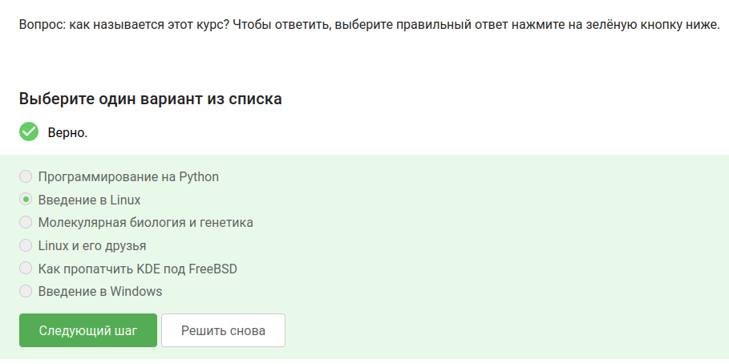{#fig-001 width=50%}

---

## Вопрос 2. Правила курса

**Ответ:**
- Не выкладывать решения
- Дедлайнов нет
- Решать самостоятельно

**Пояснение:** В курсе действительно нет дедлайнов, баллы за неверные попытки не снимаются, а публикация решений запрещена — это написано в правилах.

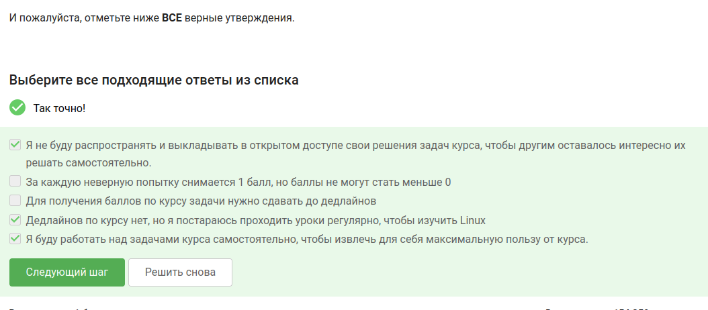{#fig-002 width=50%}

---

## Вопрос 3. Какая ОС у меня

**Ответ:** Windows / Linux (какая есть)

**Пояснение:** Я выбрала ту операционную систему, которая у меня установлена на основном компьютере.

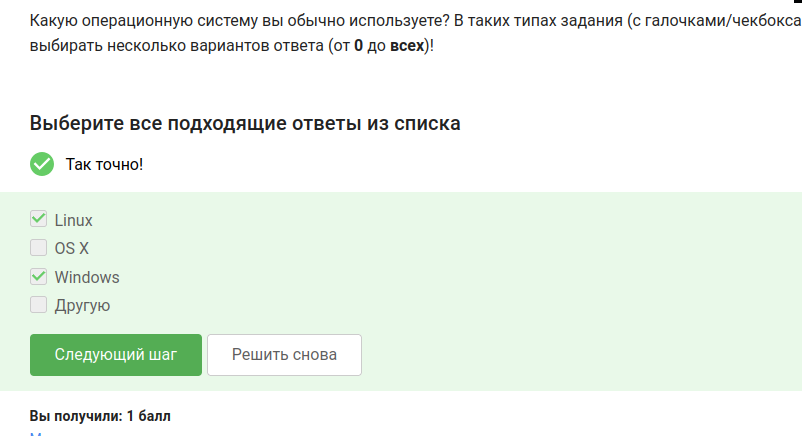{#fig-003 width=50%}

---

## Вопрос 4. Что такое виртуальная машина

**Ответ:** Программа для запуска одной ОС внутри другой

**Пояснение:** Виртуальная машина эмулирует аппаратное обеспечение и позволяет запускать гостевую операционную систему внутри хостовой.

{#fig-004 width=50%}

---

## Вопрос 5. Запустился ли Linux

**Ответ:** Да

**Пояснение:** Linux был успешно установлен и запущен на виртуальной машине.

{#fig-005 width=50%}

---

# **Вопросы 6-10. Программы и установка**

## Вопрос 6. Документ в LibreOffice

**Ответ:** Файл 1.fodt

**Пояснение:** Документ создан в LibreOffice Writer, использован шрифт FreeMono, сохранён в формате Flat XML (FODT), как требует задание.

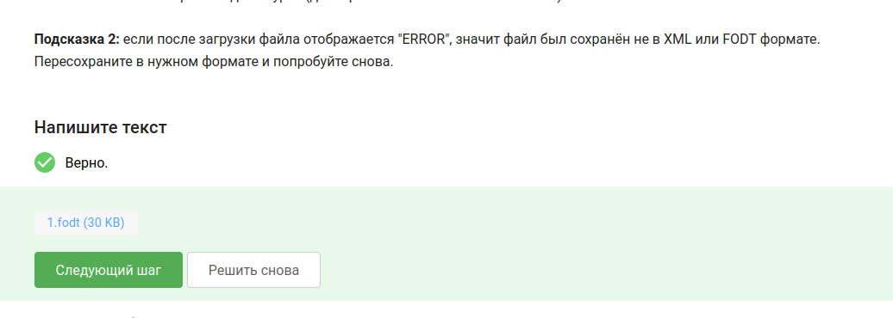{#fig-006 width=50%}

---

## Вопрос 7. Расширение пакетов в Ubuntu

**Ответ:** deb

**Пояснение:** В Ubuntu и других Debian-подобных системах установочные пакеты имеют расширение .deb. В Fedora (которую я ставила) — .rpm, но вопрос про Ubuntu.

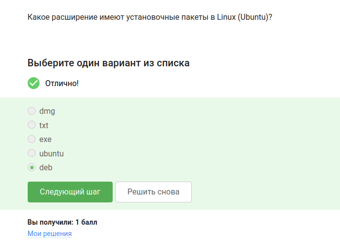{#fig-008 width=50%}

---

## Вопрос 8. VLC — фамилия автора

**Ответ:** Denis-Courmont

**Пояснение:** Я установила VLC, зашла в справку, открыла вкладку с авторами — первая фамилия оказалась Denis-Courmont.

{#fig-009 width=50%}

---

{#fig-010 width=50%}

---

## Вопрос 9. Update Manager

**Ответ:**
- Обновление всей системы
- Обновление программ

**Пояснение:** Update Manager отвечает за обновление системы и установленных приложений, но не за установку/удаление программ.

{#fig-011 width=50%}

---

## Вопрос 10. Синонимы командной строки

**Ответ:** Терминал, Консоль

**Пояснение:** «Терминал» и «консоль» — это программные эмуляторы командной строки, они обозначают одно и то же.

---

# **Вопросы 11-13. Навигация и ls**

## Вопрос 11. Команда для текущего каталога

**Ответ:** pwd

**Пояснение:** pwd (print working directory) выводит полный путь к текущему каталогу. Другие варианты не работают.

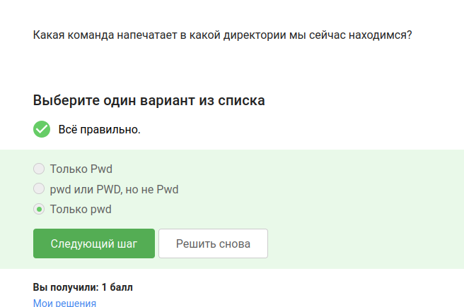{#fig-013 width=50%}

---

## Вопрос 12. Эквивалентные команды ls

**Ответ:**
- ls -lAh /some/directory
- ls --human-readable -A -l /some/directory
- ls --almost-all --human-readable -l /some/directory

**Пояснение:** У всех этих команд одни и те же опции: -A (почти всё, кроме . и ..), -l (подробно), -h (размеры в удобном виде). Порядок опций не важен.

{#fig-014 width=50%}

---

## Вопрос 13. Показать Downloads из Documents

**Ответ:**
- ls /home/bi/Downloads
- ls ~/Downloads

**Пояснение:** Тильда (~) заменяет путь к домашней папке. Оба варианта ведут в одно место.

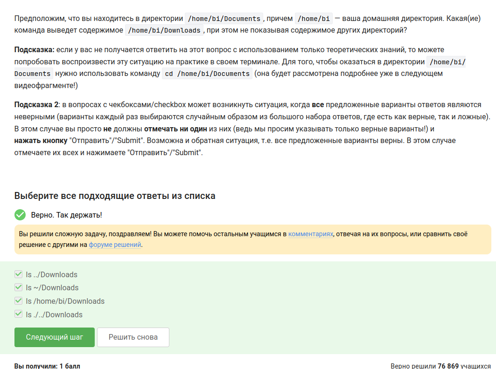{#fig-015 width=50%}

---

# **Вопросы 14-18. Процессы и управление**

## Вопрос 14. Удаление директорий

**Ответ:** rm -r

**Пояснение:** Опция -r (recursive) позволяет удалять каталоги вместе со всем содержимым. Без неё rm удаляет только файлы.

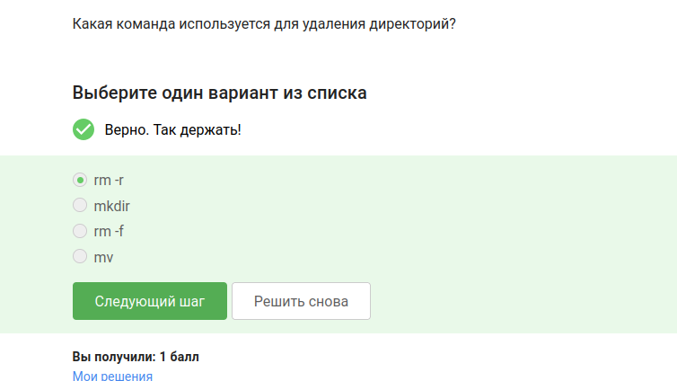{#fig-016 width=50%}

---

## Вопрос 15. Firefox и exit

**Ответ:** Терминал закроется, Firefox останется

**Пояснение:** Firefox был запущен из терминала, но не завершился при вводе exit. Завершился только терминал, а браузер продолжает работать.

{#fig-017 width=50%}

---

## Вопрос 16. Что делает &

**Ответ:** Запуск, Ctrl+Z, bg

**Пояснение:** & сразу запускает программу в фоновом режиме. Вручную это делается так: запуск, затем приостановка (Ctrl+Z) и перевод в фон (bg).

{#fig-018 width=50%}

---

## Вопрос 17. Запуск программы из файла

**Ответ:** 2026-05-15 21:38:39 Control sum: 957

**Пояснение:** Файл скачан, сделан исполняемым (chmod +x), запущен. Программа выдала текущую дату и контрольную сумму.

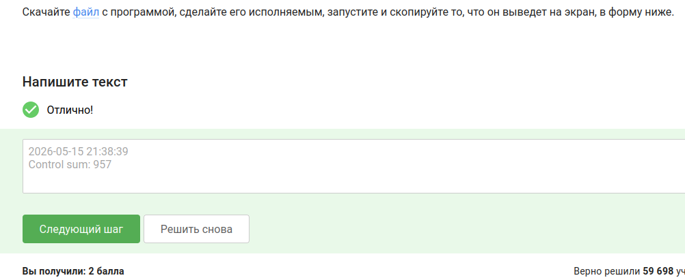{#fig-019 width=50%}

---

## Вопрос 18. Куда выводится stderr

**Ответ:** На экран

**Пояснение:** По умолчанию стандартный поток ошибок (stderr) выводится на экран, как и стандартный вывод (stdout).

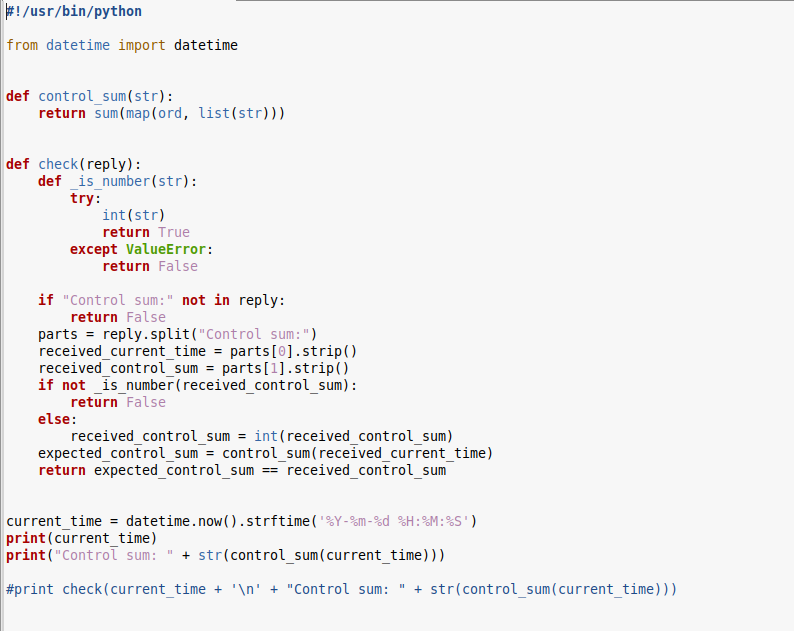{#fig-020 width=50%}

---

{#fig-021 width=50%}

---

# **Вопросы 19-21. Перенаправление и wget**

## Вопрос 19. Записать ошибки в файл

**Ответ:**
- program 2> file.txt
- program 2>> file.txt

**Пояснение:** 2> перенаправляет поток ошибок в файл (перезапись), 2>> — добавление в конец. Другие варианты либо неверны, либо перенаправляют stdout.

{#fig-022 width=50%}

---

## Вопрос 20. Ошибки в конвейере

**Ответ:** Выводятся на экран

**Пояснение:** По конвейеру (pipe) передаётся только stdout, а stderr по умолчанию идёт на экран.

{#fig-023 width=50%}

---

## Вопрос 21. Путь к скачанной картинке

**Ответ:** /home/alex/Pictures/1.jpg

**Пояснение:** -P задаёт директорию для сохранения, -O задаёт имя файла. Картинка сохранится как /home/alex/Pictures/1.jpg.

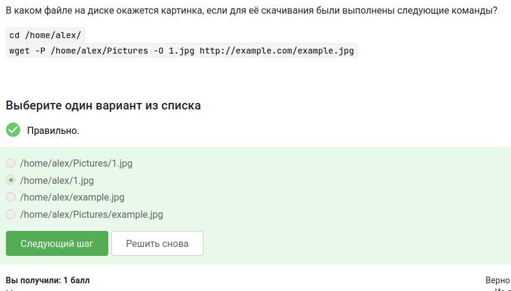{#fig-024 width=50%}

---

# **Вопросы 22-24. wget и архивация**

## Вопрос 22. Тихий wget

**Ответ:** -q или --quiet

**Пояснение:** Опция -q (quiet) подавляет все сообщения wget, включая прогресс и подключения.

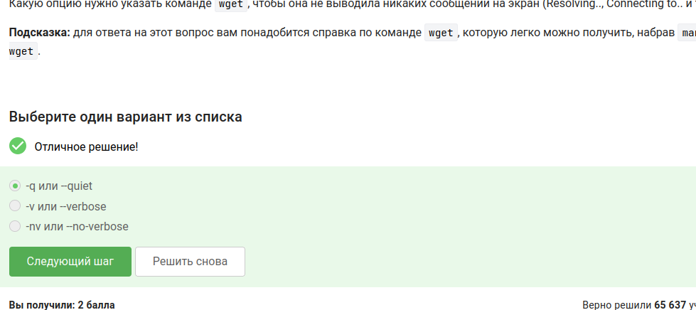{#fig-025 width=50%}

---

## Вопрос 23. wget -r -l 1 -A jpg

**Ответ:** Только jpg

**Пояснение:** Опция -A jpg ограничивает загрузку файлами с расширением jpg. HTML и png не качаются.

{#fig-026 width=50%}

---

## Вопрос 24. Отличие gzip от zip

**Ответ:** gzip удаляет архив после распаковки

**Пояснение:** При распаковке gzip удаляет .gz-файл, оставляя только распакованный файл. zip этого не делает.

{#fig-027 width=50%}

---

## Вопрос 25. Архиваторы для папок

**Ответ:** zip, tar

**Пояснение:** gzip сжимает только один файл. Для архивации директорий используют tar (который сначала объединяет файлы в один) или zip.

{#fig-028 width=50%}

---

## Вопрос 26. Опции tar для bz2

**Ответ:** -cjf

**Пояснение:** -c — создание архива, -j — сжатие bzip2, -f — файл. -x распаковывает, -z для gzip, -t для просмотра.

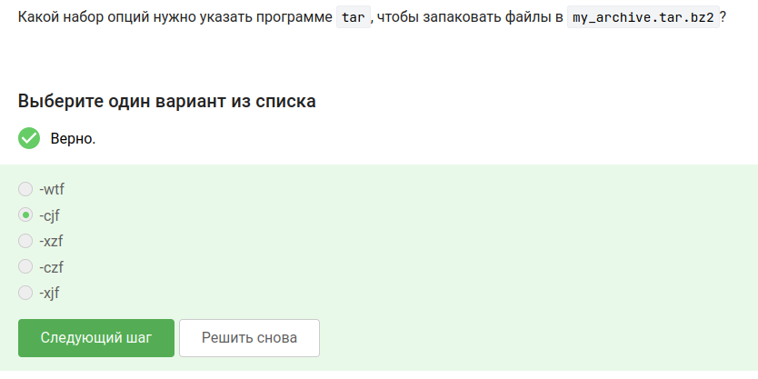{#fig-029 width=50%}

---

# **Вопросы 27-29. Поиск и grep**

## Вопрос 27. Маски find НЕ найдут Alexey.jpeg

**Ответ:**
- *..?
- *jpg
- alexey.*

**Пояснение:** *..? — ищет файлы, где перед последним символом две точки. *jpg — ищет .jpg, а нужно .jpeg. alexey.* — имя с маленькой буквы, а в файле с большой.

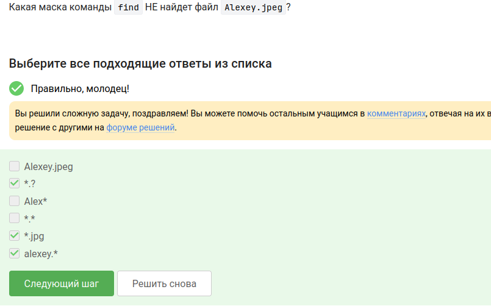{#fig-030 width=50%}

---

## Вопрос 28. grep "world"

**Ответ:**
- world
- The beautiful-world is not enough
- The world is not enough
- The beautifulworld is not enough

**Пояснение:** grep ищет точное вхождение "world". Регистр важен, поэтому World с большой буквы не подходит. Слова с дефисом подходят, если внутри есть "world".

{#fig-031 width=50%}

---

## Вопрос 29. Поиск "love" у Шекспира

**Ответ:** Файл love_lines.txt

**Пояснение:** Архив скачан, распакован, зашла в папку и выполнила grep -h "love" *.txt > love_lines.txt. Получился файл со всеми строчками, где есть love.

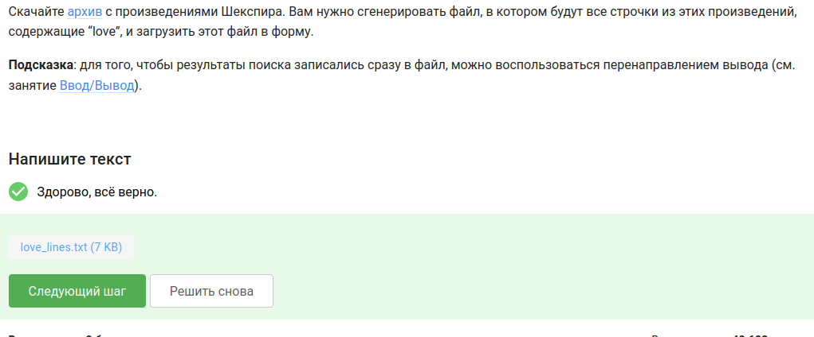{#fig-032 width=50%}

---

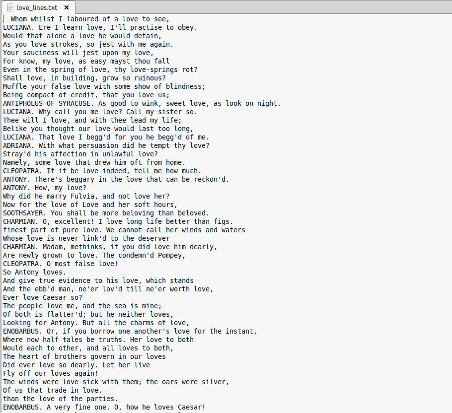{#fig-033 width=50%}

---

# **Выводы**

## Что я научилась делать

- Работать в командной строке
- Управлять процессами (фон, передний план, kill)
- Перенаправлять вывод и ошибки
- Архивировать файлы (tar, gzip, zip)
- Скачивать через wget
- Искать файлы и текст (find, grep)

Все задания первого раздела выполнены.

---
