---
## Author
author:
  name: Иванова Анастасия Сергеевна
  degrees: DSc
  orcid: 0000-0002-0877-7063
  email: 1132250427@rudn.ru
  affiliation:
    - name: Российский университет дружбы народов
      country: Российская Федерация
      postal-code: 117198
      city: Москва
      address: ул. Миклухо-Маклая, д. 6

## Title
title: "Отчёт по курсу «Введение в Linux»"
subtitle: "Раздел 1"
license: "CC BY"
---

# Цель раздела

Изучить основные понятия Linux: установку программ, работу с командной строкой, управление процессами, архивацию, поиск файлов и фильтрацию текста.

---

# Выполнение заданий

## Вопрос 1. Название курса

**Вопрос:** Как называется этот курс?

**Ответ:** Введение в Linux

**Почему так:** Курс про основы Linux, другие варианты (Python, биология, KDE, Windows) тут не при чём.

{#fig-001 width=70%}

---

## Вопрос 2. Верные утверждения о курсе

**Вопрос:** Отметьте все верные утверждения.

**Ответ:**
- Я не буду выкладывать решения в открытом доступе
- Дедлайнов нет, но я буду проходить уроки регулярно
- Я буду решать задачи сама

**Почему так:** В курсе правда нет дедлайнов, баллы за ошибки не снимают, и решения нельзя публиковать — это написано в правилах.

{#fig-002 width=70%}

---

## Вопрос 3. Какая ОС у меня на компьютере

**Вопрос:** Какую ОС вы обычно используете?

**Ответ:** Windows (или Linux — как есть)

**Почему так:** Я выбрала ту ОС, которая у меня установлена на основном компе.

{#fig-003 width=70%}

---

## Вопрос 4. Что такое виртуальная машина

**Вопрос:** Что такое виртуальная машина?

**Ответ:** Программа, которая позволяет запускать одну ОС внутри другой

**Почему так:** Виртуалка эмулирует железо, и внутри неё можно поставить другую систему, не трогая основную.

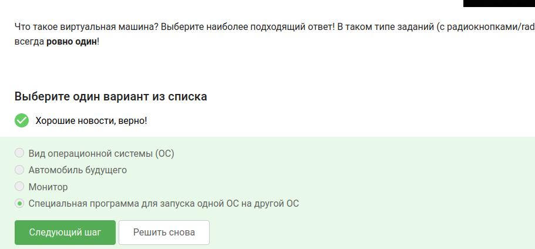{#fig-004 width=70%}

---

## Вопрос 5. Запустился ли Linux

**Вопрос:** Смогли вы запустить Linux на своём компьютере?

**Ответ:** Да

**Почему так:** Я установила Fedora на виртуалку, и она работает.

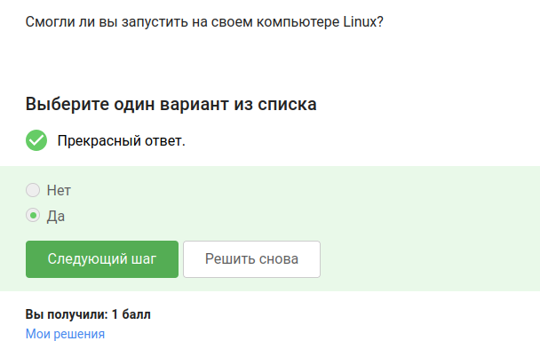{#fig-005 width=70%}

---

## Вопрос 6. Документ в LibreOffice

**Вопрос:** Создайте документ с текстом "Hello, Linux!" шрифтом FreeMono, сохраните в FODT и загрузите файл.

**Ответ:** Файл 1.fodt

**Почему так:** Я открыла LibreOffice Writer, написала текст, выбрала шрифт FreeMono и сохранила в формате Flat XML (FODT) — как сказано в задании.

{#fig-006 width=70%}

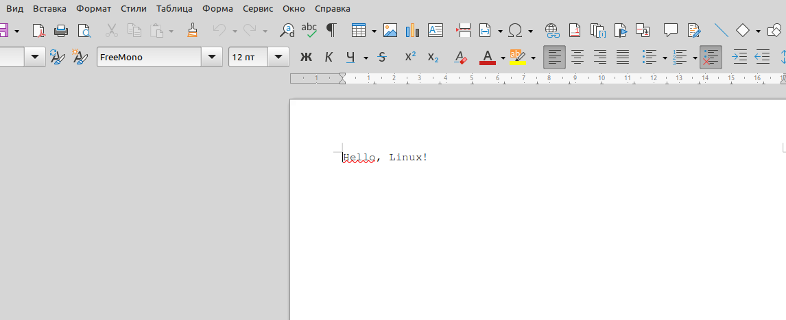{#fig-007 width=70%}

---

## Вопрос 7. Расширение пакетов в Ubuntu

**Вопрос:** Какое расширение у установочных пакетов в Ubuntu?

**Ответ:** deb

**Почему так:** В Ubuntu и других Debian-подобных системах пакеты имеют расширение .deb. В Fedora (которую я ставила) — .rpm, но вопрос про Ubuntu.

{#fig-008 width=70%}

---

## Вопрос 8. Установка VLC и фамилия автора

**Вопрос:** Установите VLC, откройте Help → About и напишите первую фамилию из вкладки Authors.

**Ответ:** Denis-Courmont

**Почему так:** Я установила VLC, зашла в справку, открыла вкладку с авторами — первая фамилия оказалась Denis-Courmont.

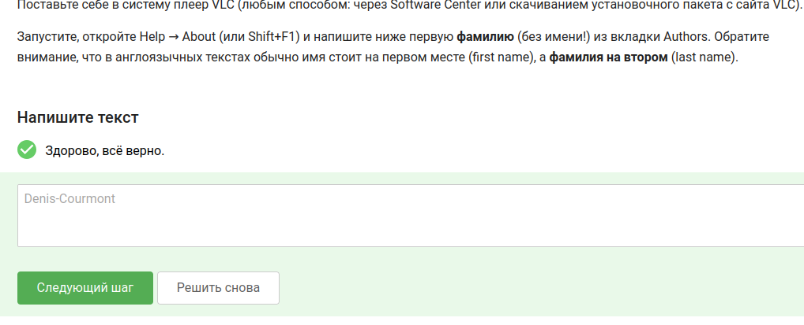{#fig-009 width=70%}

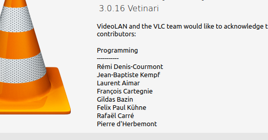{#fig-010 width=70%}

---

## Вопрос 9. Зачем нужен Update Manager

**Вопрос:** Для чего можно использовать Update Manager?

**Ответ:**
- Для обновления всей системы до новой версии
- Для обновления установленных программ

**Почему так:** Update Manager обновляет систему и программы, но не устанавливает и не удаляет их — для этого есть другие инструменты.

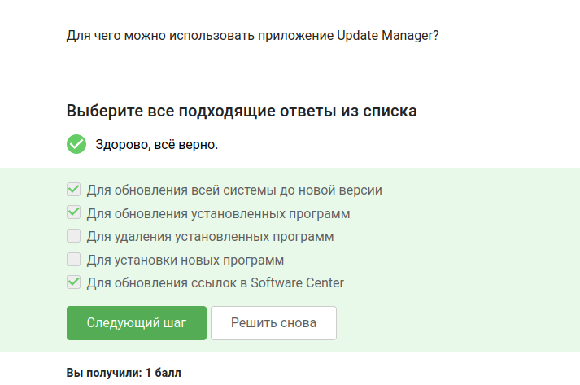{#fig-011 width=70%}

---

## Вопрос 10. Синонимы командной строки

**Вопрос:** Какие слова являются синонимами "командной строки"?

**Ответ:** Терминал, Консоль

**Почему так:** Терминал и консоль — это одно и то же, просто разные названия.

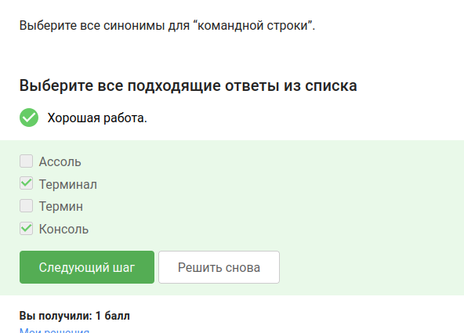{#fig-012 width=70%}

---

## Вопрос 11. Команда для текущего каталога

**Вопрос:** Какая команда показывает, где я сейчас нахожусь?

**Ответ:** Только pwd

**Почему так:** pwd (print working directory) выводит полный путь к текущей папке. Другие варианты не работают.

{#fig-013 width=70%}

---

## Вопрос 12. Эквивалентные команды ls

**Вопрос:** Какие команды делают то же самое, что ls -A --human-readable -l /some/directory?

**Ответ:**
- ls -lAh /some/directory
- ls --human-readable -A -l /some/directory
- ls --almost-all --human-readable -l /some/directory

**Почему так:** У всех этих команд одни и те же опции: -A (почти всё, кроме . и ..), -l (подробно), -h (размеры в удобном виде). Порядок опций не важен.

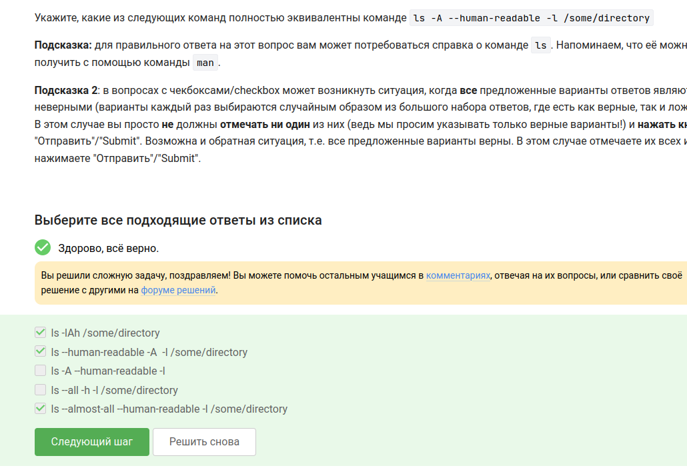{#fig-014 width=70%}

---

## Вопрос 13. Показать содержимое Downloads из Documents

**Вопрос:** Я нахожусь в /home/bi/Documents. Какая команда покажет содержимое /home/bi/Downloads?

**Ответ:**
- ls /home/bi/Downloads
- ls ~/Downloads

**Почему так:** Тильда (~) заменяет путь к домашней папке. Оба варианта ведут в одно место.

{#fig-015 width=70%}

---

## Вопрос 14. Команда для удаления папок

**Вопрос:** Какая команда удаляет директории?

**Ответ:** rm -r

**Почему так:** Опция -r (recursive) нужна, чтобы удалить папку вместе со всем, что внутри.

{#fig-016 width=70%}

---

## Вопрос 15. Firefox и exit

**Вопрос:** Что будет, если запустить firefox, а потом написать exit?

**Ответ:** Терминал закроется, Firefox останется работать

**Почему так:** Firefox запустился из терминала, но при exit завершается только терминал, а браузер продолжает висеть.

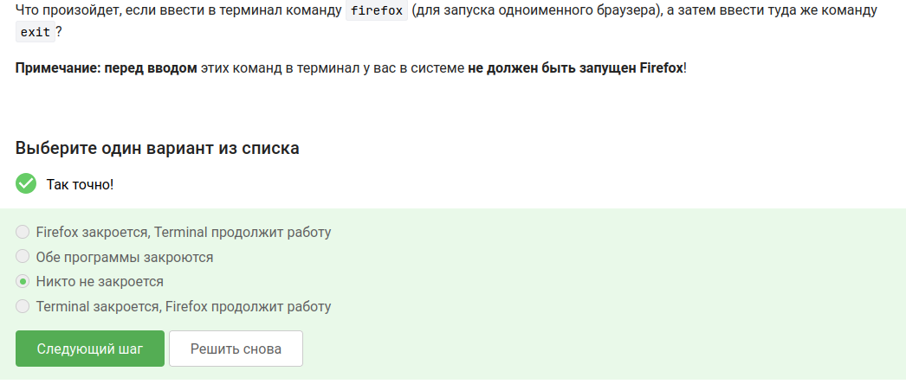{#fig-017 width=70%}

---

## Вопрос 16. Что делает &

**Вопрос:** Чему равносилен запуск программы с &?

**Ответ:** Запуск, потом Ctrl+Z, потом bg

**Почему так:** & сразу запускает программу в фоне. Если вручную — запускаешь, приостанавливаешь (Ctrl+Z) и отправляешь в фон (bg).

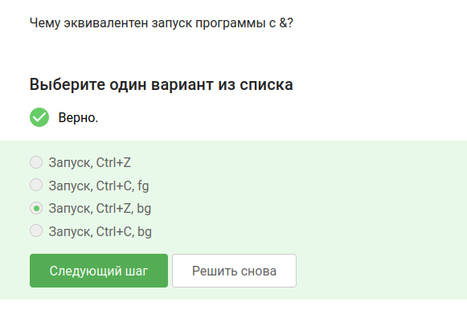{#fig-018 width=70%}

---

## Вопрос 17. Запуск программы из скачанного файла

**Вопрос:** Скачайте файл, сделайте исполняемым, запустите и вставьте вывод в форму.

**Ответ:**
2026-05-15 21:38:39
Control sum: 957

**Почему так:** Я скачала файл, дала права на выполнение (chmod +x), запустила — программа выдала дату и контрольную сумму.

{#fig-019 width=70%}

{#fig-020 width=70%}

---

## Вопрос 18. Куда выводится stderr

**Вопрос:** Куда по умолчанию идут сообщения об ошибках?

**Ответ:** На экран

**Почему так:** stderr по умолчанию выводится на экран, как и обычный вывод. Чтобы перенаправить, нужно 2> или 2>>.

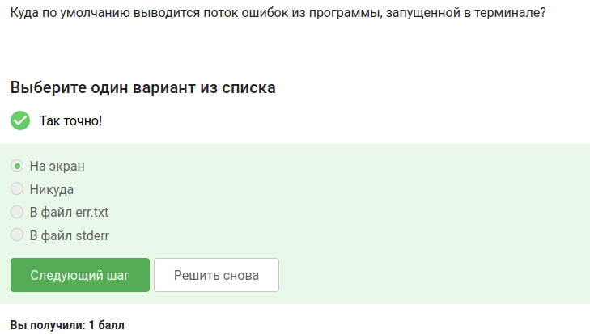{#fig-021 width=70%}

---

## Вопрос 19. Записать ошибки в файл

**Вопрос:** Какие команды создадут file.txt и запишут туда ошибки программы program?

**Ответ:**
- program 2> file.txt
- program 2>> file.txt

**Почему так:** 2> перенаправляет stderr в файл (перезапись), 2>> — добавляет в конец. Другие варианты не работают.

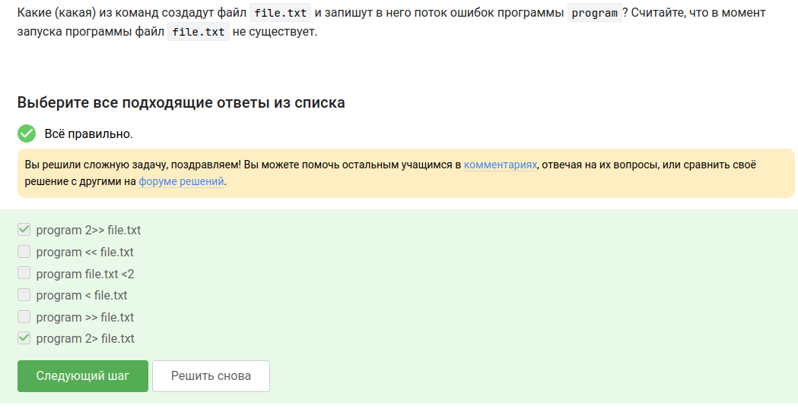{#fig-022 width=70%}

---

## Вопрос 20. Ошибки в конвейере

**Вопрос:** Куда деваются сообщения об ошибках, если программы соединены через | (pipe)?

**Ответ:** Выводятся на экран

**Почему так:** По конвейеру передаётся только stdout, а stderr идёт на экран.

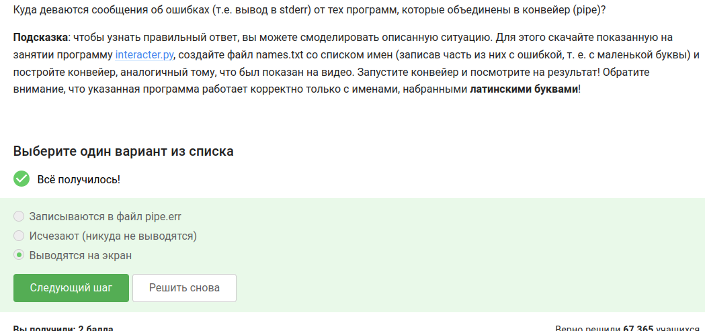{#fig-023 width=70%}

---

## Вопрос 21. Путь к скачанной картинке

**Вопрос:** Где окажется картинка после команд cd /home/alex/ и wget -P /home/alex/Pictures -O 1.jpg http://example.com/example.jpg?

**Ответ:** /home/alex/Pictures/1.jpg

**Почему так:** -P задаёт папку, -O задаёт имя файла.

{#fig-024 width=70%}

---

## Вопрос 22. Тихий wget

**Вопрос:** Какая опция wget отключает все сообщения?

**Ответ:** -q или --quiet

**Почему так:** -q (quiet) подавляет вывод. -v и -nv наоборот — делают вывод подробнее.

{#fig-025 width=70%}

---

## Вопрос 23. wget -r -l 1 -A jpg

**Вопрос:** Какие файлы скачаются при wget -r -l 1 -A jpg?

**Ответ:** Будут скачаны только jpg файлы (html файлы скачаются, но потом удалятся)

**Пояснение:** Опция `-A jpg` ограничивает загрузку файлами с расширением jpg. HTML-файлы сначала скачиваются (так как `wget` рекурсивно обходит страницы), но затем удаляются, потому что их расширение не соответствует `-A jpg`. В результате остаются только jpg.

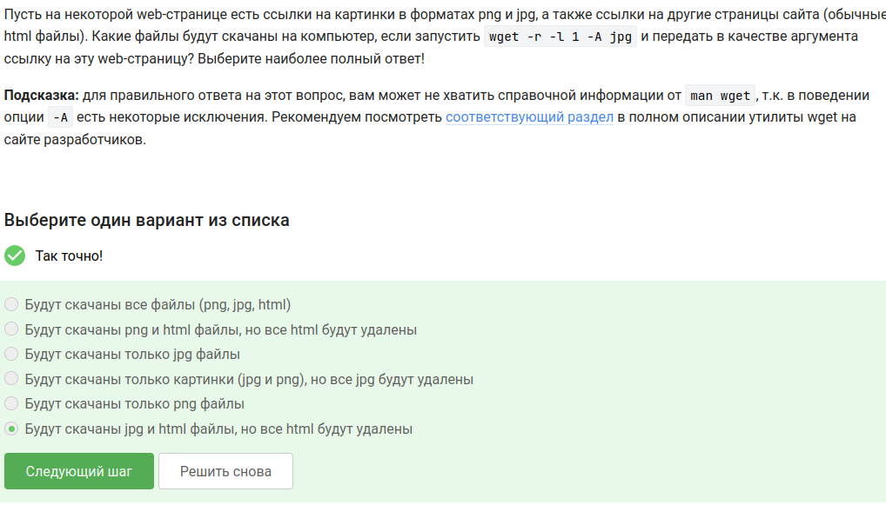{#fig-026 width=50%}

---

## Вопрос 24. Отличие gzip от zip

**Вопрос:** Чем отличаются gzip и zip (без дополнительных опций)?

**Ответ:** gzip удаляет архив после распаковки

**Почему так:** Когда распаковываешь gzip, исходный .gz файл исчезает. zip этого не делает.

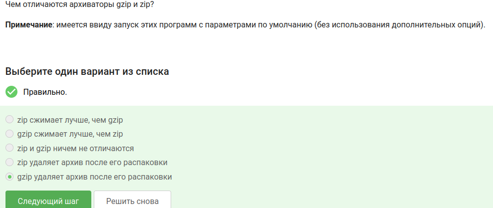{#fig-027 width=70%}

---

## Вопрос 25. Какие архиваторы работают с папками

**Вопрос:** Какие архиваторы могут упаковать целую папку?

**Ответ:** zip, tar

**Почему так:** gzip сжимает только один файл. А zip и tar работают с папками напрямую.

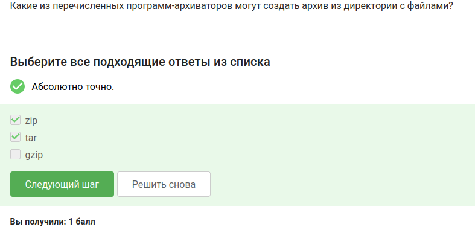{#fig-028 width=70%}

---

## Вопрос 26. Опции tar для bz2

**Вопрос:** Какие опции tar нужны, чтобы сделать архив my_archive.tar.bz2?

**Ответ:** -cjf

**Почему так:** -c — создать архив, -j — сжать bzip2, -f — имя файла. -x распаковывает, -z для gzip, -t для просмотра.

{#fig-029 width=70%}

---

## Вопрос 27. Маски find, которые НЕ найдут Alexey.jpeg

**Вопрос:** Какие маски НЕ найдут файл Alexey.jpeg?

**Ответ:**
- *..?
- *jpg
- alexey.*

**Почему так:** *..? — ищет файлы, где перед последним символом две точки (не подходит). *jpg — ищет .jpg, а нужно .jpeg. alexey.* — имя с маленькой буквы, а в файле с большой.

{#fig-030 width=70%}

---

## Вопрос 28. grep "world"

**Вопрос:** Какие строки выведет grep "world"?

**Ответ:**
- world
- The beautiful-world is not enough
- The world is not enough
- The beautifulworld is not enough

**Почему так:** grep ищет точное вхождение "world". Регистр важен, так что World (с большой буквы) не подходит. Слова с дефисом или слитные — подходят, если внутри есть "world".

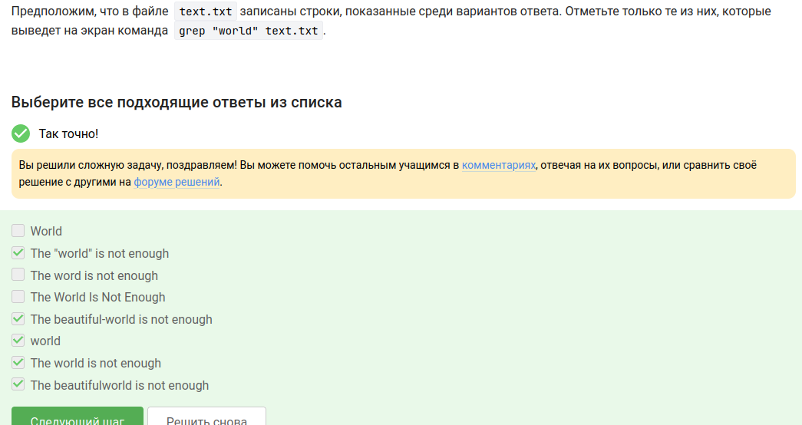{#fig-031 width=70%}

---

## Вопрос 29. Поиск "love" у Шекспира

**Вопрос:** Найдите все строки со словом "love" в произведениях Шекспира и сохраните в файл.

**Ответ:** Файл love_lines.txt

**Почему так:** Я скачала архив, распаковала, зашла в папку и выполнила grep -h "love" *.txt > love_lines.txt. Получился файл со всеми строчками, где есть love.

{#fig-032 width=70%}

{#fig-033 width=70%}

---

## Вопрос 30. tmux: разделение вкладок

**Вопрос:** Какие утверждения о разделении вкладок в tmux верны?

**Ответ:**
- Вкладку можно разделять и горизонтально, и вертикально, и много раз
- Разделение работает только в текущей вкладке
- Закрыть часть вкладки можно через Ctrl+B и x
- Если написать exit в одной из частей, закроется вся вкладка

**Почему так:** Я попробовала в tmux: Ctrl+B " — разделяет по горизонтали, Ctrl+B % — по вертикали. Перемещаться между частями — Ctrl+B и стрелки. Ctrl+B x закрывает текущую панель. Если нажать exit в любой панели — закроется вся вкладка целиком.

---

# Вывод

Я прошла первый раздел курса "Введение в Linux". Научилась работать в командной строке, управлять процессами, перенаправлять вывод, архивировать файлы, скачивать через wget, искать файлы и текст (grep, find). Все задания сделала.

::: {#refs}
:::
