---
author:
  name: Иванова Анастасия Сергеевна
  degrees: DSc
  orcid: 0000-0002-0877-7063
  email: 1132250427@rudn.ru
  affiliation:
    name: Российский университет дружбы народов
    country: Российская Федерация
    postal-code: 117198
    city: Москва
    address: ул. Миклухо-Маклая, д. 6
title: "Отчёт по курсу «Введение в Linux»"
subtitle: "Раздел 2 - удалённая работа, процессы и биоинформатика"
license: "CC BY"
---

# Цель раздела

Изучить удалённую работу с серверами, управление процессами, работу с tmux, установку и использование биоинформатических программ (FastQC, Clustal, bowtie2).

---

# Выполнение заданий

## Вопрос 1. Для чего можно использовать удалённый сервер

**Вопрос:** Для каких задач можно использовать удалённый сервер?

**Ответ:**
- Хранение конфиденциальных данных
- Хранение общедоступных данных
- Хранение больших объёмов данных
- Выполнение сложных вычислений

**Почему так:** Удалённый сервер - это просто компьютер где-то в другом месте. На нём можно хранить любые данные и запускать тяжёлые задачи.

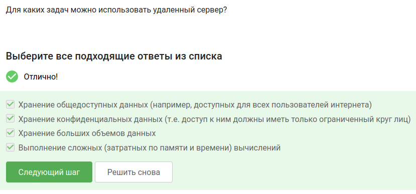{#fig-001 width=70%}

---

## Вопрос 2. Какой SSH-ключ можно пересылать

**Вопрос:** Какой из ключей (id_rsa и id_rsa.pub) можно безопасно пересылать по интернету?

**Ответ:** id_rsa.pub

**Почему так:** Публичный ключ (.pub) можно показывать всем. Приватный ключ (без .pub) должен оставаться только у вас.

{#fig-002 width=70%}

---

## Вопрос 3. Копирование папки на сервер

**Вопрос:** Какая команда скопирует папку stepic на сервер в домашнюю директорию?

**Ответ:** scp -r stepic username@server:~/

**Почему так:** scp копирует файлы по сети, -r нужна для рекурсивного копирования папок.

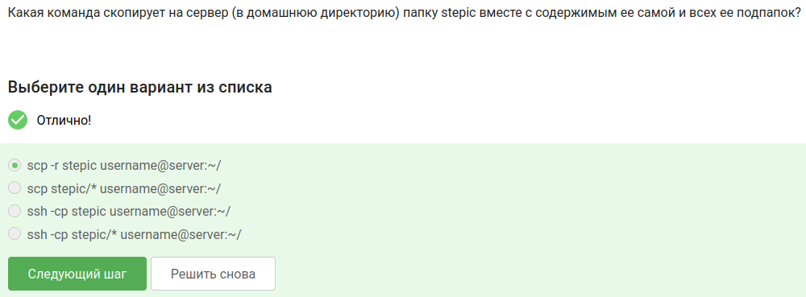{#fig-003 width=70%}

---

## Вопрос 4. Ошибка apt-get install: что делать

**Вопрос:** apt-get install не может найти пакет. Что делать?

**Ответ:**
- Проверить интернет
- Проверить место на диске

**Почему так:** Если нет интернета - неоткуда скачать. Если место кончилось - некуда сохранять.

{#fig-004 width=70%}

---

## Вопрос 5. Для чего можно использовать Filezilla

**Вопрос:** Какие действия можно делать с Filezilla?

**Ответ:**
- Копировать файлы с компьютера на сервер
- Копировать файлы с сервера на компьютер
- Просматривать содержимое папок на сервере

**Почему так:** Filezilla - это FTP-клиент. Он умеет смотреть что на сервере и перекидывать файлы туда-обратно.

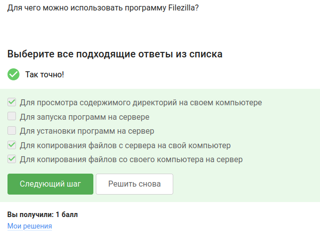{#fig-005 width=70%}

---

## Вопрос 6. Если программе нужен не терминал, а экран

**Вопрос:** Что делать, если на сервере программа требует графический экран?

**Ответ:**
- Поискать терминальную версию
- Запустить на своём компьютере

**Почему так:** Не у всех программ есть консольная версия. Если нет - придётся запускать там, где есть экран.

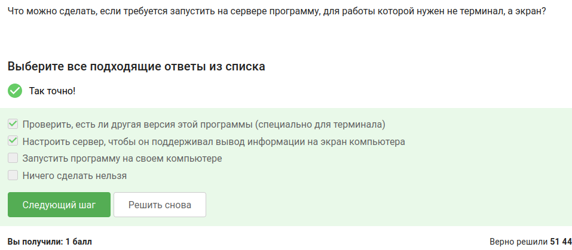{#fig-006 width=70%}

---

## Вопрос 7. Как вызвать справку о программе

**Вопрос:** Как обычно можно вызвать справку о программе program?

**Ответ:**
- help program
- man program
- program --help

**Почему так:** Это стандартные способы - man, --help, help.

{#fig-007 width=70%}

---

## Вопрос 8. Какие форматы данных принимает FastQC

**Вопрос:** Какие форматы файлов может анализировать FastQC?

**Ответ:** fastq, fasta, bam, sam

**Почему так:** FastQC нужен для проверки качества данных секвенирования, а это самые популярные форматы в биоинформатике.

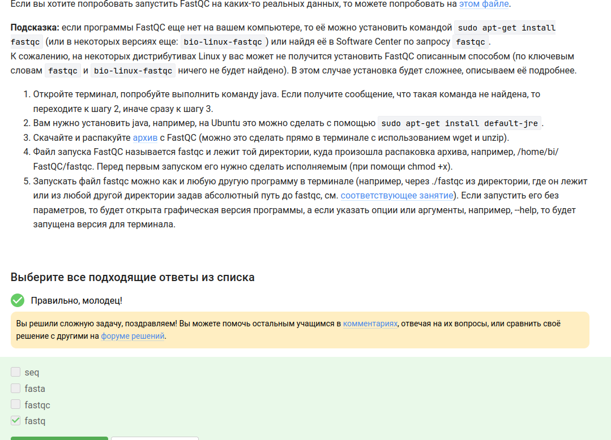{#fig-008 width=70%}

---

## Вопрос 9. Команда для запуска Clustal

**Вопрос:** Какая команда запускает Clustal на файле test.fasta и делает множественное выравнивание?

**Ответ:** clustalw -infile=test.fasta -align

**Почему так:** -infile указывает входной файл, -align явно говорит "делай выравнивание".

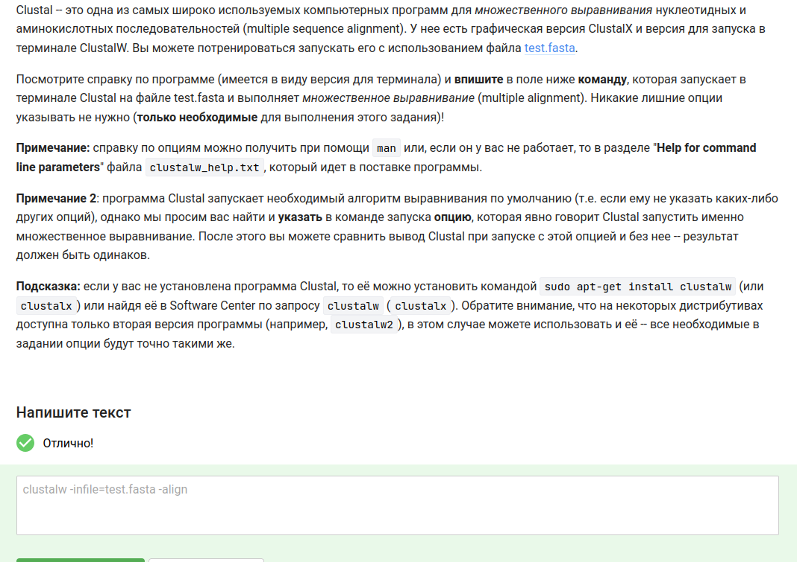{#fig-009 width=70%}

---

## Вопрос 10. После fg, Ctrl+C, fg, Ctrl+Z — что покажет jobs

**Вопрос:** Запустили три программы в фоне, сделали fg %1, Ctrl+C, fg %2, Ctrl+Z. О ком jobs?

**Ответ:** Только о program2 и program3

**Почему так:** program1 завершили (Ctrl+C), program2 приостановили (Ctrl+Z), program3 остался в фоне.

{#fig-010 width=70%}

---

## Вопрос 11. Одинаковые ли PID в jobs, top и ps

**Вопрос:** PID одной и той же программы в jobs, top и ps — они одинаковые?

**Ответ:** У всех одинаковые

**Почему так:** PID - это номер процесса в системе. Где бы ты на него ни посмотрел, он один и тот же.

{#fig-011 width=70%}

---

## Вопрос 12. Команда для мгновенного завершения процесса

**Вопрос:** Как мгновенно завершить остановленный процесс?

**Ответ:** kill -9

**Почему так:** kill -9 отправляет сигнал SIGKILL, который нельзя перехватить или проигнорировать.

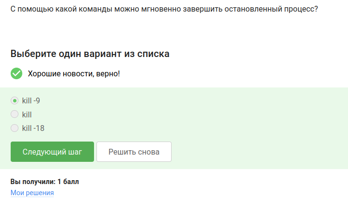{#fig-012 width=70%}

---

## Вопрос 13. kill (без опций) для приостановленного процесса

**Вопрос:** Что будет, если использовать kill (без опций) на процессе, приостановленном через Ctrl+Z?

**Ответ:** Процесс завершится, когда его продолжат

**Почему так:** Пока процесс стоит (приостановлен), сигнал до него не доходит. Как только он продолжит работу (fg или bg), сигнал сработает.

{#fig-013 width=70%}

---

## Вопрос 14. Сколько CPU использует остановленный процесс

**Вопрос:** Сколько процентов CPU ест процесс после Ctrl+Z?

**Ответ:** 0% CPU

**Почему так:** Остановленный процесс не выполняется, он просто висит в памяти.

{#fig-014 width=70%}

---

## Вопрос 15. Сколько памяти занимает остановленный процесс

**Вопрос:** А память? Она освобождается?

**Ответ:** Столько же, сколько занимал в момент остановки

**Почему так:** Память не освобождается при остановке, только при полном завершении.

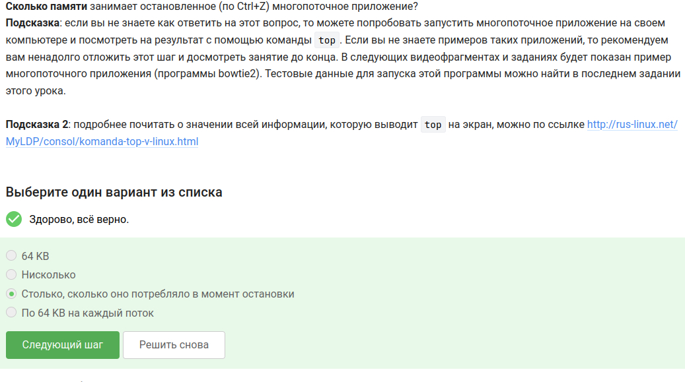{#fig-015 width=70%}

---

## Вопрос 16. Как завершить один поток многопоточного приложения

**Вопрос:** Как завершить отдельный поток?

**Ответ:** Никак

**Почему так:** В Linux нельзя завершить один поток, только весь процесс целиком.

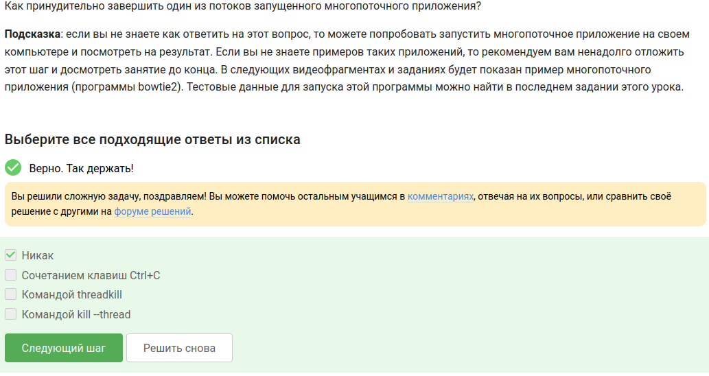{#fig-016 width=70%}

---

## Вопрос 17. Какой шаг bowtie2 можно делать в несколько потоков

**Вопрос:** Какой из двух шагов (bowtie2-build и bowtie2) можно запускать в несколько потоков?

**Ответ:** Только bowtie2

**Почему так:** Выравнивание (bowtie2) хорошо параллелится, а построение индекса (bowtie2-build) традиционно однопоточное.

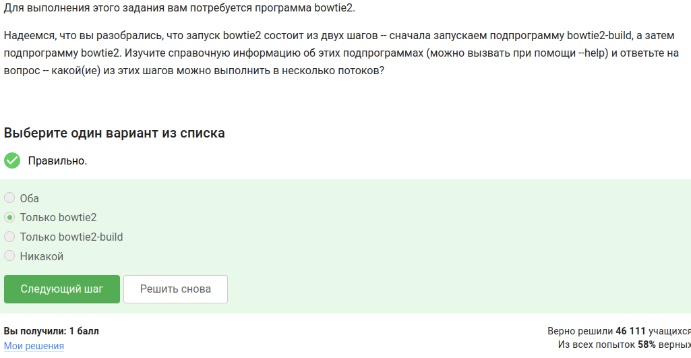{#fig-017 width=70%}

---

## Вопрос 18. Bowtie2 — stderr многопоточного запуска

**Вопрос:** Скачайте файлы, запустите bowtie2, сохраните stderr второго этапа и загрузите файл.

**Ответ:** Файл bowtie2_stderr_pt.txt

**Почему так:** Я запустила bowtie2 с опцией -p $(nproc) (многопоточный режим), сохранила вывод ошибок через 2> и загрузила полученный файл.

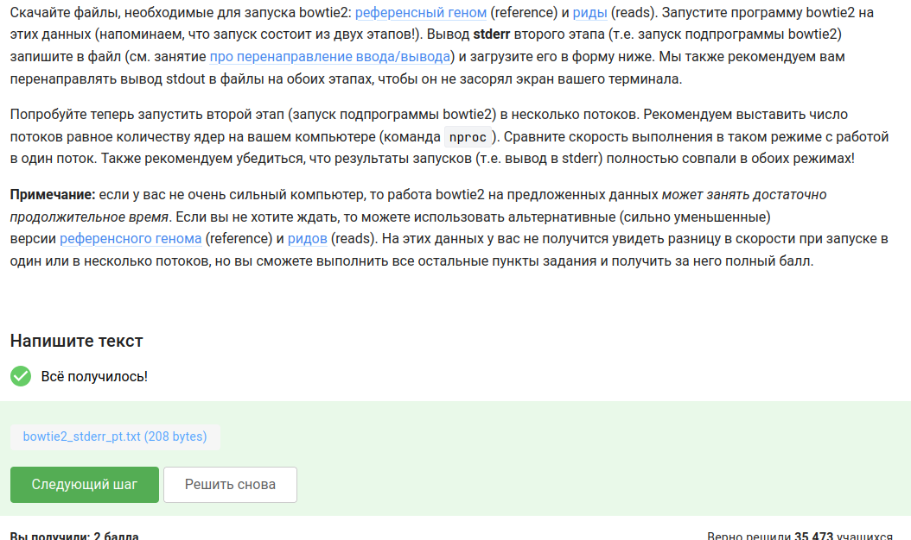{#fig-018 width=70%}

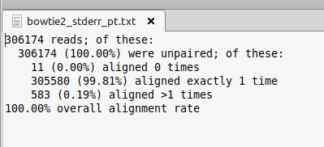{#fig-019 width=70%}

---

## Вопрос 19. tmux: последняя вкладка и exit

**Вопрос:** В tmux осталась последняя вкладка. Что будет при exit?

**Ответ:** tmux завершит работу

**Почему так:** Если закрыть последнюю вкладку, сессия tmux заканчивается.

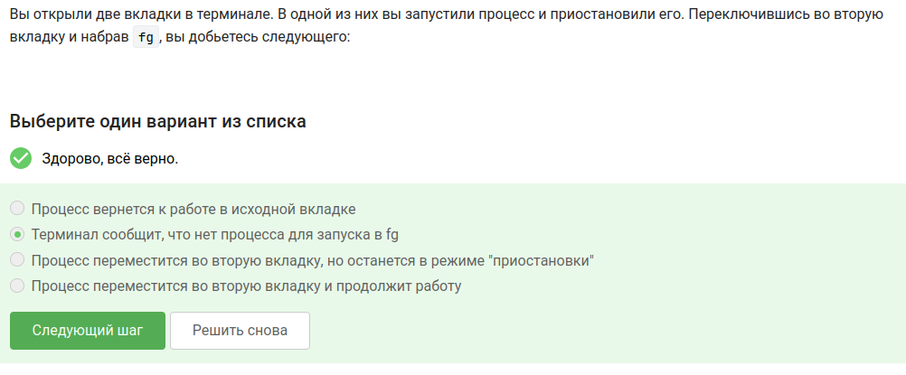{#fig-020 width=70%}

{#fig-021 width=70%}

---

## Вопрос 20. Закрытие терминала с запущенным tmux на сервере

**Вопрос:** Зашли на сервер, запустили tmux, начали работать. Закрыли терминал. Что с tmux?

**Ответ:** Соединение прервётся, но tmux продолжит работу

**Почему так:** В этом и смысл tmux - сессия остаётся на сервере, даже если отвалился SSH.

{#fig-022 width=70%}

---

## Вопрос 21. Фоновый процесс в tmux и закрытие вкладки

**Вопрос:** Запустили процесс в фоне в одной вкладке tmux, потом закрыли вкладку (Ctrl+B, X). Что с процессом?

**Ответ:** Вкладка и процесс закроются

**Почему так:** Всё, что запущено внутри вкладки, умирает вместе с вкладкой.

{#fig-023 width=70%}

---

## Вопрос 22. Переименование вкладки в tmux

**Вопрос:** Какая команда переименовывает текущую вкладку в tmux?

**Ответ:** Ctrl+B и , (запятая)

**Почему так:** Стандартное сочетание - префикс Ctrl+B, потом запятая.

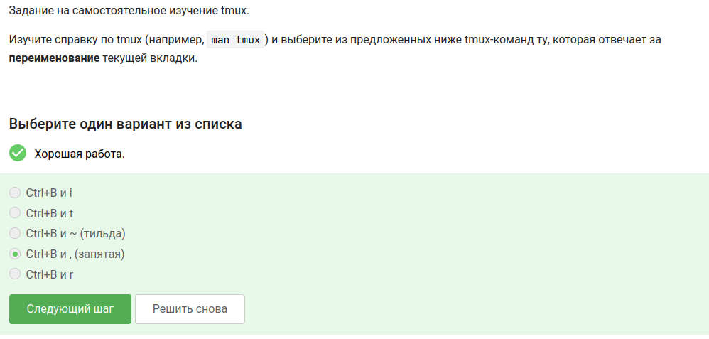{#fig-024 width=70%}

---

## Вопрос 23. Разделение вкладок в tmux — верные утверждения

**Вопрос:** Какие утверждения о разделении вкладок в tmux верны?

**Ответ:**
- Вкладку можно делить и горизонтально, и вертикально, и много раз
- Разделение работает только в текущей вкладке
- Можно закрыть одну из частей (Ctrl+B и x)
- Если набрать exit в одной из частей, закроется вся вкладка

**Почему так:** Я сама пробовала в tmux. Ctrl+B " - горизонтальное разделение, Ctrl+B % - вертикальное. Ctrl+B x закрывает одну панель, exit в любой панели - всю вкладку.

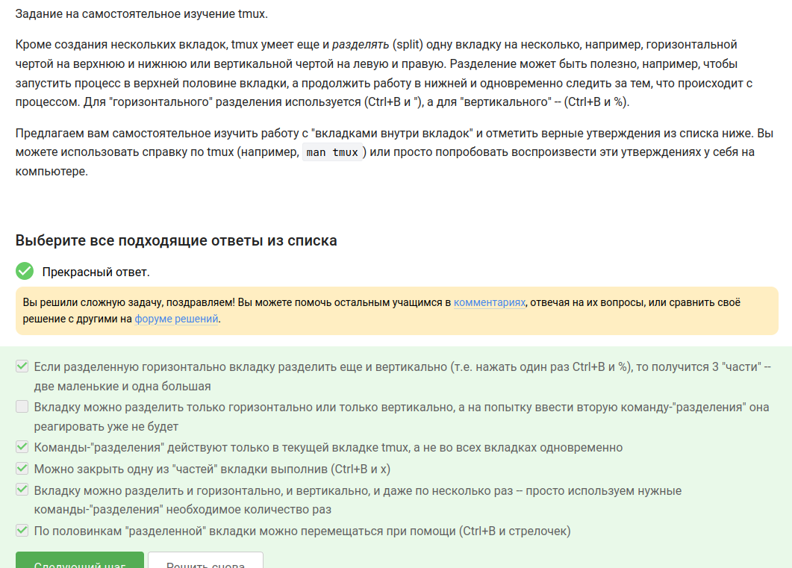{#fig-025 width=70%}

---
# Вывод

Я прошла второй раздел курса. Научилась работать с удалёнными серверами, копировать файлы (scp, Filezilla), управлять процессами (kill, fg, bg, jobs), разбираться с tmux, устанавливать и запускать биоинформатические программы (FastQC, Clustal, bowtie2).

::: {#refs}
:::
