---
author:
  name: Иванова Анастасия Сергеевна
  degrees: DSc
  orcid: 0000-0002-0877-7063
  email: 1132250427@rudn.ru
  affiliation:
    name: Российский университет дружбы народов
    country: Российская Федерация
    postal-code: 117198
    city: Москва
    address: ул. Миклухо-Маклая, д. 6
title: "Курс «Введение в Linux»"
subtitle: "Раздел 3 — vim, bash-скрипты, sed, gnuplot"
license: CC BY
date: today
date-format: "YYYY-MM-DD"
format:
  revealjs:
    theme: default
    slide-number: true
    preview-links: auto
  pptx: default
  beamer:
    toc: true
    toc-title: "Содержание"
    number-sections: true
    pdf-engine: lualatex
    mainfont: Liberation Serif
    sansfont: Liberation Sans
    monofont: Liberation Mono
    lang: ru-RU
    babel-lang: russian
    babel-otherlangs: english
---

# Докладчик

:::::::::::::: {.columns align=center}
::: {.column width="70%"}

  * Иванова Анастасия Сергеевна
  * 1 курс группа НКАбд-07-25
  * Российский университет дружбы народов
  * [1132250427@rudn.ru](mailto:1132250427@rudn.ru)

:::
::: {.column width="30%"}

{width=100%}

:::
::::::::::::::

---

## Вопрос 1. Как выйти из vim

**Ответ:** : затем q затем Enter

**Почему так:** В vim выход через командный режим: Esc, потом :, потом q, потом Enter.

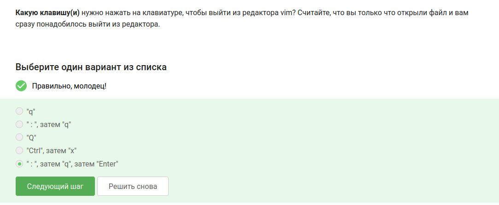{#fig-001 width=70%}

---

## Вопрос 2. Перемещение по словам в vim

**Ответ:**
- В этой строке 5 "больших слов" (WORD)
- В этой строке 9 "слов" (word)
- Нажимая только на w, нельзя переместить курсор на "."
- Чтобы попасть в конец строки, нужно меньше нажатий на W, чем на w
- Нажимая только на W, нельзя переместить курсор на "."

**Почему так:** w — по словам (буквы, цифры, _). W — по большим словам (разделитель — только пробел).

{#fig-002 width=40%}

---

## Вопрос 3. Редактирование строки в vim

**Вопрос:** Как превратить "one two three four five" в "three four four four five"?

**Ответ:** d2wwywPp

**Почему так:** d2w — удалить два слова, w — вперёд, yw — скопировать слово, P — вставить перед курсором, p — вставить после.

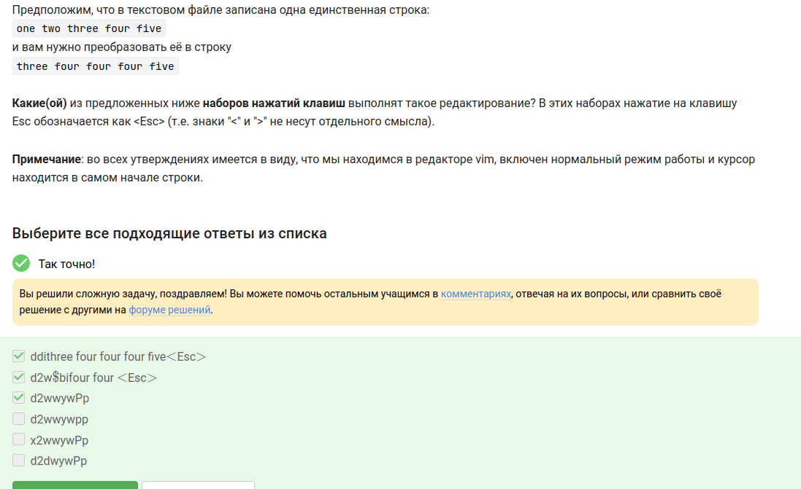{#fig-003 width=50%}

---

## Вопрос 4. Замена Windows на Linux в vim

**Ответ:** :%s/Windows/Linux

**Почему так:** % — все строки, s — замена, без g — только первое вхождение в строке.

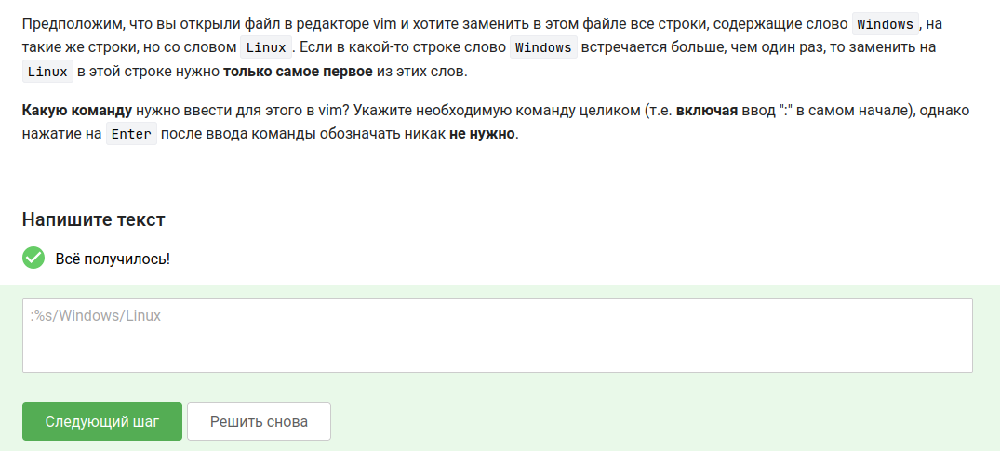{#fig-004 width=70%}

---

## Вопрос 5. Режим выделения в vim

**Ответ:**
- В режиме выделения можно использовать d и y
- Режим выделения открывается по нажатию "v"
- В режиме выделения можно использовать w, e, $ и др.
- Внизу редактора горит -- VISUAL --
- Выйти из режима выделения можно, нажав Esc два раза

**Почему так:** Я открыла vimtutor и нашла раздел про Visual mode.

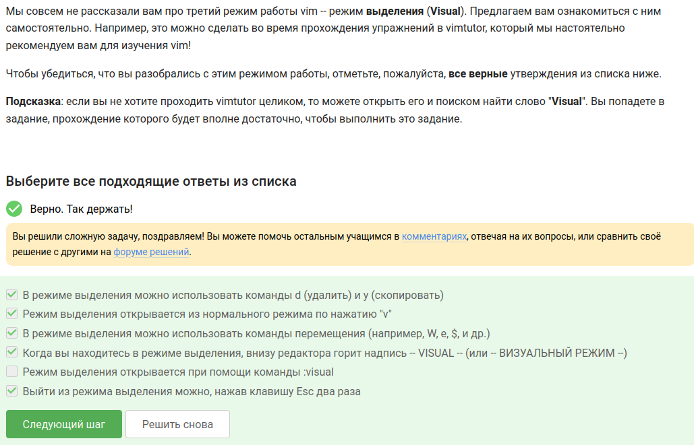{#fig-005 width=50%}

---

## Вопрос 6. Запуск оболочки из оболочки

**Ответ:** Только из набора C

**Почему так:** История команд принадлежит текущей оболочке. Новая оболочка получает новую пустую историю.

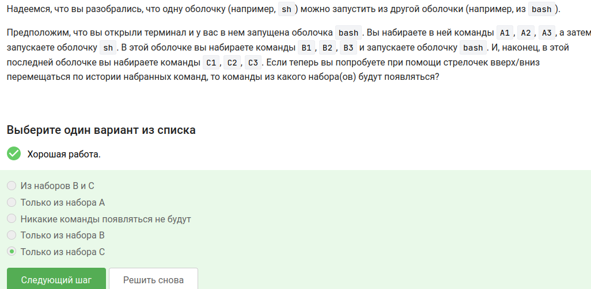{#fig-006 width=70%}

---

## Вопрос 7. Работа cd и touch в скрипте

**Ответ:** /home/bi/file1.txt

**Почему так:** cd меняет директорию внутри скрипта. touch создаёт файл там, где ты находишься.

{#fig-007 width=50%}

---

## Вопрос 8. Имена переменных в bash

**Ответ:**
- _variable
- VARIable
- variable_123
- variable123

**Почему так:** Имя переменной может содержать буквы, цифры и _, но не может начинаться с цифры и не может содержать спецсимволы.

{#fig-008 width=50%}

---

## Вопрос 9. Скрипт с двумя аргументами

**Ответ:**
```bash
#!/bin/bash
echo "Arguments are: \$1=$1 \$2=$2"
```

**Почему так:** $1 и $2 — аргументы скрипта. Обратный слеш нужен, чтобы вывести именно "$1", а не значение.

{#fig-009 width=40%}

---

## Вопрос 9. Скрипт с двумя аргументами

{#fig-010 width=50%}

---

## Вопрос 10. Условия, которые всегда истинны

**Ответ:**
- -z ""
- $# -ge 0
- -e $0
- -s $0

**Почему так:** -z "" — пустая строка, всегда истина. $# -ge 0 — всегда. -e $0 и -s $0 — сам скрипт существует и не пустой.

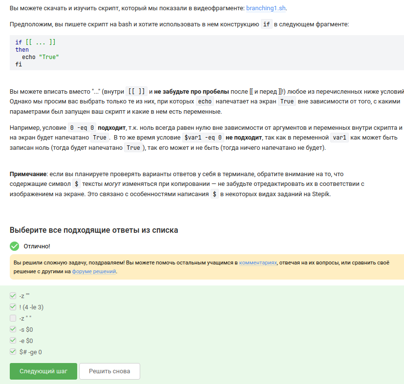{#fig-011 width=40%}

---

## Вопрос 10. Условия, которые всегда истинны

{#fig-012 width=50%}

---

## Вопрос 11. Скрипт для определения возрастной группы

**Ответ:** Решение в скриншоте

**Почему так:** Бесконечный цикл while, read запрашивает имя и возраст, проверки через if и elif.

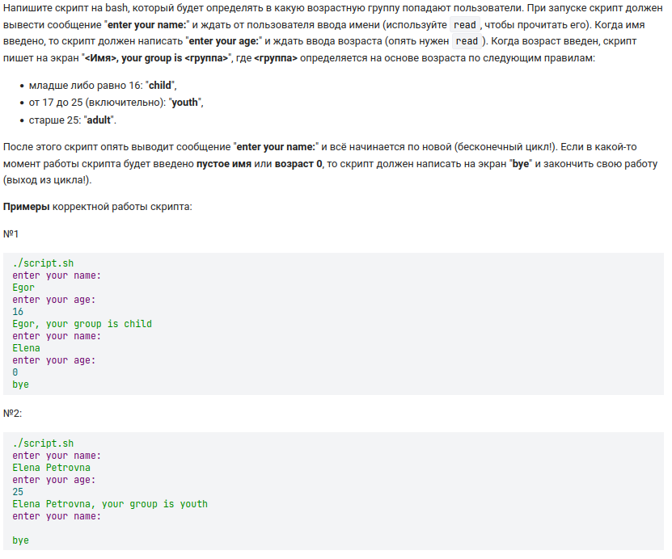{#fig-016 width=40%}

---

## Вопрос 11. Скрипт для определения возрастной группы

{#fig-017 width=50%}

---

## Вопрос 12. Инструкции, увеличивающие a на b

**Ответ:**
- let a=a+b
- let "a+=b"

**Почему так:** a=$a+$b — просто строка. a+=$b — не работает. let "a+=b" — правильно.

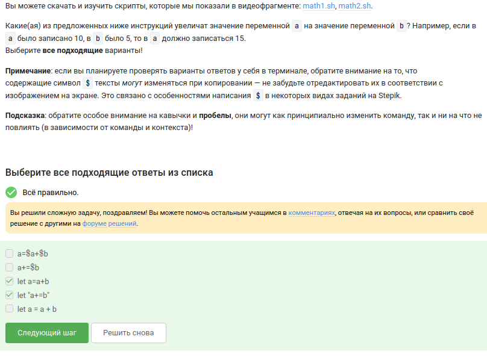{#fig-018 width=50%}

---

## Вопрос 13. Что выведет echo "`pwd`"

**Ответ:** /home/bi

**Почему так:** Обратные кавычки выполняют pwd. cd уже сменил директорию на /home/bi/.

{#fig-019 width=50%}

---

## Вопрос 13. Что выведет echo "`pwd`"

{#fig-020 width=50%}

---

## Вопрос 14. Как проверить код возврата

**Ответ:** Сначала запустить program, затем if [[ $? -eq 0 ]]

**Почему так:** $? хранит код возврата последней выполненной команды.

{#fig-021 width=50%}

---

## Вопрос 15. Глобальные и локальные переменные

**Ответ:** counters are 55 and 110

**Почему так:** c1 — сумма чисел от 1 до 10 = 55. c2 — сумма удвоенных чисел = 2*55 = 110.

{#fig-022 width=50%}

---

## Вопрос 16. Нахождение НОД

**Ответ:** Решение в скриншоте

**Почему так:** Функция gcd вызывает сама себя. При M != N из большего вычитаем меньшее. При пустом вводе — "bye".

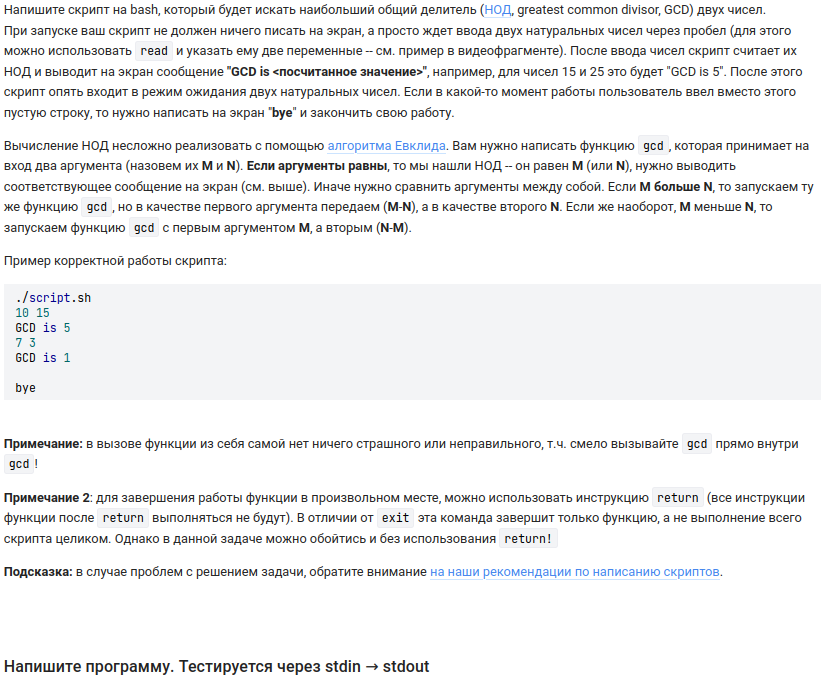{#fig-023 width=40%}

---

## Вопрос 16. Нахождение НОД

{#fig-024 width=40%}

---

## Вопрос 17. Калькулятор

**Ответ:** Решение в скриншоте

**Почему так:** Бесконечный цикл, case обрабатывает операции, "exit" выводит "bye" и выходит, иначе "error".

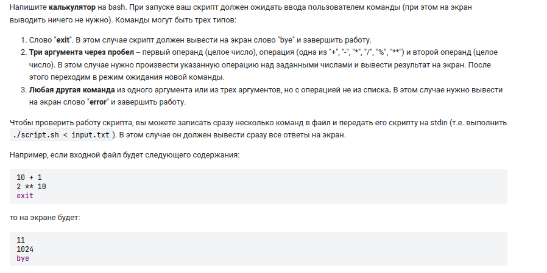{#fig-025 width=70%}

---

## Вопрос 17. Калькулятор

{#fig-026 width=50%}

---

## Вопрос 18. Поиск с -iname и -name

**Ответ:**
- Star_Wars.avi
- STARS.txt

**Почему так:** -iname не чувствительна к регистру, -name чувствительна.

{#fig-027 width=70%}

---

## Вопрос 19. Сравнение -name и -path

**Ответ:**
- В некоторых случаях find с -name найдёт больше файлов, чем с -path
- Если заменить -name на -path, результат иногда может остаться таким же

**Почему так:** -path ищет по всему пути, -name — только по имени файла.

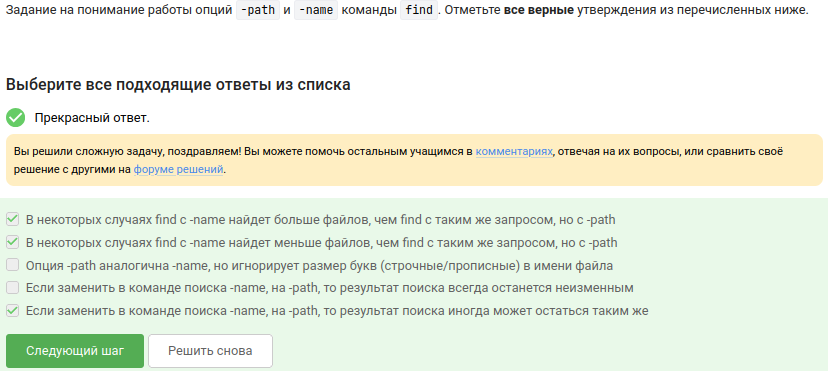{#fig-028 width=70%}

---

## Вопрос 20. Поиск с -mindepth и -maxdepth

**Ответ:** Ни один файл найден не будет

**Почему так:** file1, file2, file3 лежат на глубине 1, а диапазон 2-3.

{#fig-029 width=50%}

---

## Вопрос 21. Опции grep -A, -B, -C

**Ответ:** grep -C 1 "word" file.txt > results.txt

**Почему так:** -C 1 выводит строку + строку до и после. Это больше, чем -A 1 или -B 1.

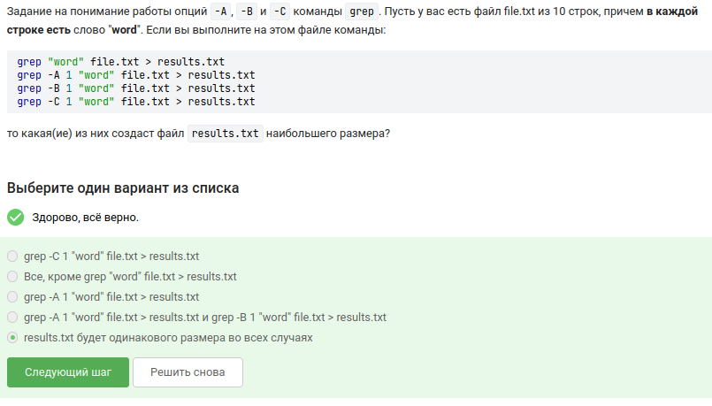{#fig-030 width=50%}

---

## Вопрос 22. Регулярное выражение в grep

**Ответ:**
- I prefer Kubuntu
- Hmm, XKLubuntu
- The best OS is Xubuntu

**Почему так:** Шаблон ищет строки, заканчивающиеся на "buntu", перед которым может быть u или символ из [xKXKL].

{#fig-031 width=50%}

---

## Вопрос 23. Замена "аббревиатур" в sed

**Ответ:** sed -E 's/([A-Z]{2,})/abbreviation/g' input.txt > edited.txt

**Почему так:** [A-Z]{2,} — две или больше заглавные буквы.

{#fig-033 width=40%}

---

## Вопрос 24. Опция -p в gnuplot

**Ответ:** -p --persist

**Почему так:** Без -p графики закрываются вместе с gnuplot. С -p остаются открытыми.

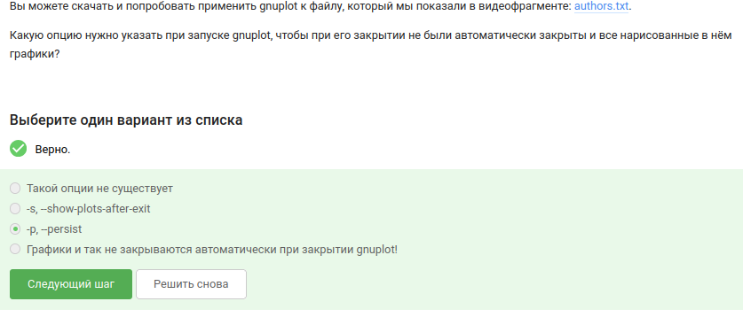{#fig-034 width=70%}

---

## Вопрос 25. Название ряда в gnuplot

**Ответ:** Название — первое значение из второго столбца, нарисовано 9 точек

**Почему так:** autotitle columnhead берёт заголовок из первой строки. Первая строка не рисуется, остаётся 9 точек.

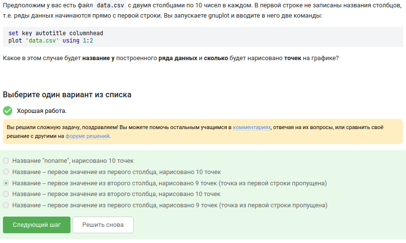{#fig-035 width=50%}

---

## Вопрос 26. Установка меток на оси в gnuplot

**Ответ:** set xtics ("point 1, value ".x1, "point 2, value ".x2, "point 3, value ".x3)

**Почему так:** Конкатенация строк через ". Без кавычек gnuplot подставит значения переменных.

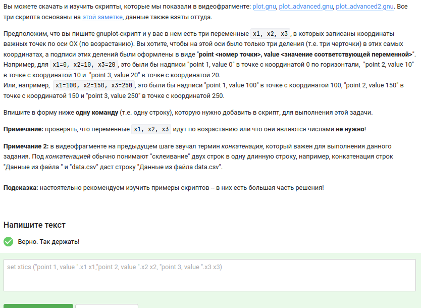{#fig-036 width=40%}

---

## Вопрос 27. Изменение анимации в gnuplot

**Ответ:**
```
a=a+1
zrot=(zrot+350)%360
set view xrot,zrot
splot -x**2-y**2
pause 0.1
if (a<50) reread
```

**Почему так:** zrot=(zrot+350)%360 — вращение в другую сторону. pause 0.1 вместо 0.2 — скорость увеличилась.

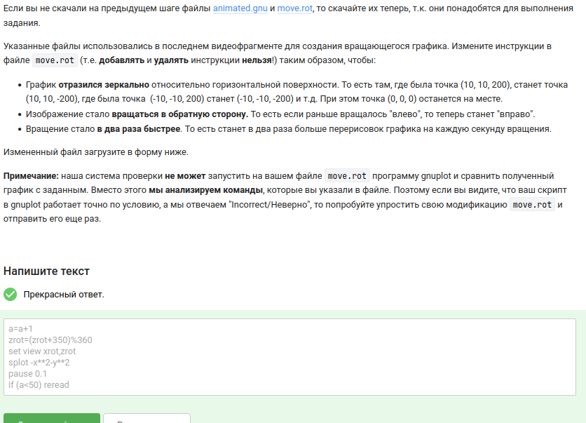{#fig-037 width=40%}

---

## Вопрос 28. Права доступа rwxrw-r--

**Ответ:** chmod u+wx file.txt; chmod g+w file.txt

**Почему так:** u+wx — добавляет владельцу w и x. g+w — добавляет группе w.

{#fig-038 width=50%}

---

## Вопрос 29. Создание файла в директории root

**Ответ:**
- sudo chown user dir
- sudo chown :group dir

**Почему так:** Если директория принадлежит root, а группа правильная, то пользователь получит права группы и сможет писать.

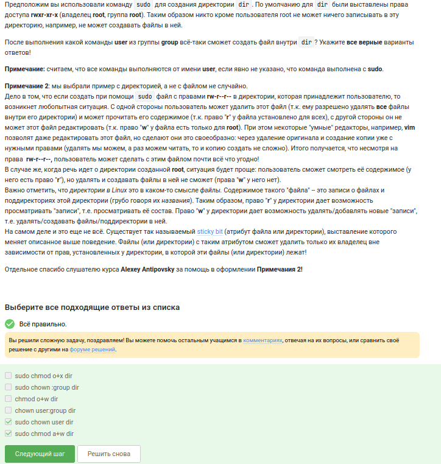{#fig-039 width=40%}

---

## Вопрос 30. Команда du для размера текущей директории

**Ответ:** du -hs

**Почему так:** du -h — человеко-читаемый формат. du -s — суммарный размер.

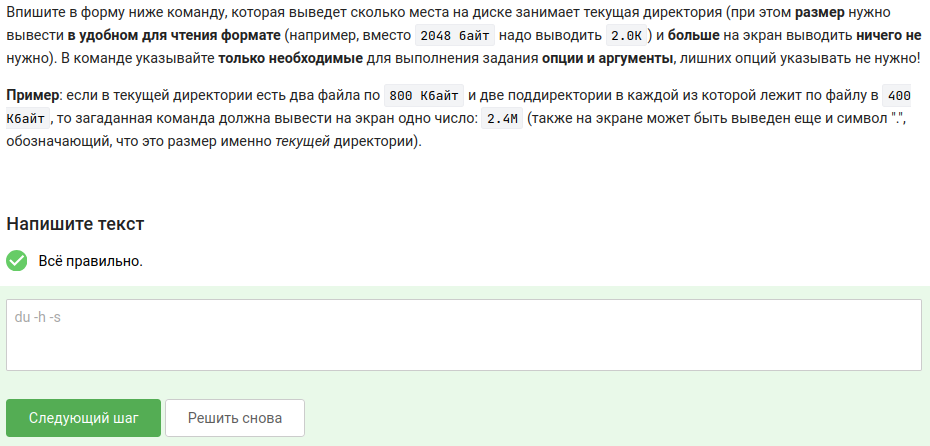{#fig-041 width=70%}

---

## Вопрос 31. Создание трёх поддиректорий

**Ответ:** mkdir dir{1..3}

**Почему так:** {1..3} разворачивается в 1 2 3. Получается mkdir dir1 dir2 dir3.

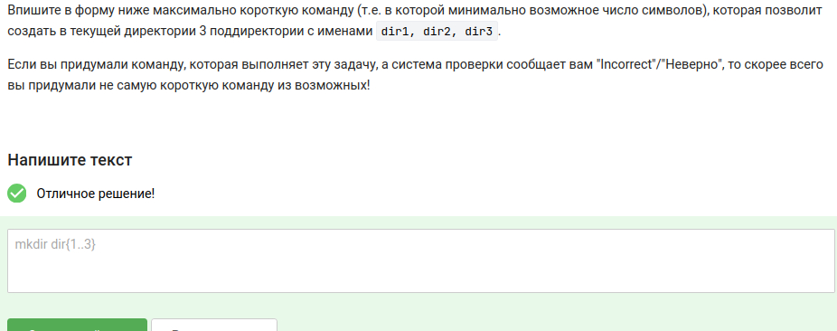{#fig-042 width=70%}

---

## Вопрос 32. Опция -n в sed

**Ответ:** На экран будет выведено всё содержимое файла

**Почему так:** Без -n sed печатает все строки по умолчанию. Команда p не меняет этого.

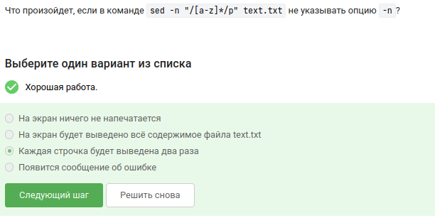{#fig-032 width=70%}

---

# Выводы

## Что я научилась делать

- Работать в vim (перемещение, замена, режимы)
- Писать bash-скрипты (переменные, условия, циклы, функции, арифметика)
- Обрабатывать текст с помощью sed
- Строить графики в gnuplot

Все задания третьего раздела выполнены.

---
