---
author:
  name: Иванова Анастасия Сергеевна
  degrees: DSc
  orcid: 0000-0002-0877-7063
  email: 1132250427@rudn.ru
  affiliation:
    name: Российский университет дружбы народов
    country: Российская Федерация
    postal-code: 117198
    city: Москва
    address: ул. Миклухо-Маклая, д. 6
title: "Отчёт по курсу «Введение в Linux»"
subtitle: "Раздел 3 - vim, bash-скрипты, sed, gnuplot"
license: "CC BY"
---

# Цель раздела

Изучить работу в редакторе vim, написание bash-скриптов (переменные, условия, циклы, функции, арифметика), обработку текста с помощью sed, построение графиков в gnuplot.

---

# Выполнение заданий

## Вопрос 1. Как выйти из vim

**Вопрос:** Какую клавишу(и) нужно нажать, чтобы выйти из редактора vim?

**Ответ:** : затем q затем Enter

**Почему так:** В vim выход из редактора происходит через командный режим: нажимаешь Esc (если не в командном режиме), потом :, потом q, потом Enter. Если файл меняли и не сохранили - нужен :q!

{#fig-001 width=70%}

---

## Вопрос 2. Перемещение по словам в vim

**Вопрос:** Разница между w и W, e и E, b и B в vim.

**Ответ:**
- В этой строке 5 "больших слов" (WORD)
- В этой строке 9 "слов" (word)
- Нажимая только на w, нельзя переместить курсор на "."
- Чтобы попасть в конец строки, нужно совершить меньше нажатий на W, чем на w
- Нажимая только на W, нельзя переместить курсор на "."

**Почему так:** w - перемещение по словам (только буквы, цифры и подчёркивания). W - по большим словам (разделители - только пробелы). Я проверила на строке "Strange_ TEXT is_here. 2=2 YES!" - получилось именно так.

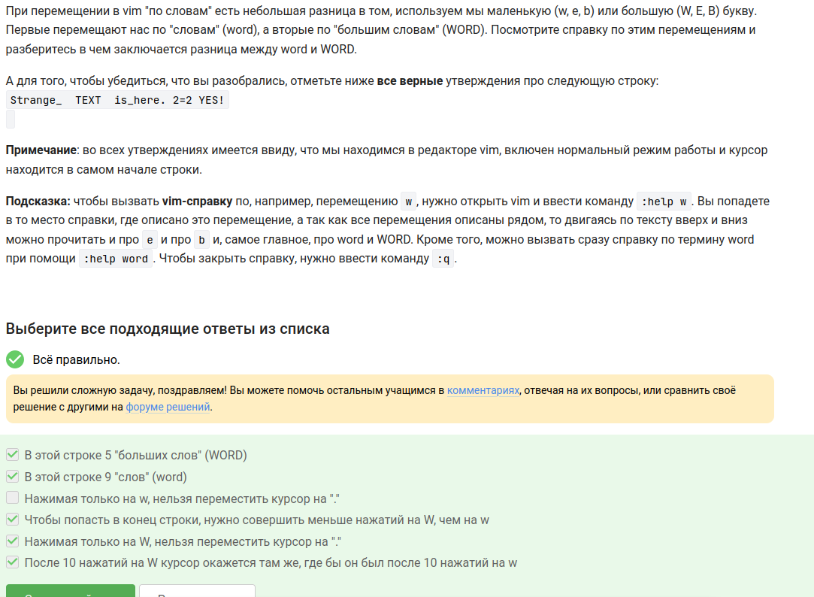{#fig-002 width=70%}

---

## Вопрос 3. Редактирование строки в vim

**Вопрос:** Как превратить "one two three four five" в "three four four four five"?

**Ответ:** d2wwywPp

**Почему так:** d2w - удалить два слова ("one two"), w - переместиться вперёд, yw - скопировать текущее слово ("three"), P - вставить перед курсором, p - вставить после курсора.

{#fig-003 width=70%}

---

## Вопрос 4. Замена Windows на Linux в vim

**Вопрос:** Какая команда vim заменит первое вхождение Windows на Linux в каждой строке?

**Ответ:** :%s/Windows/Linux

**Почему так:** % - для всех строк, s - замена, без флага g - только первое вхождение в строке.

{#fig-004 width=70%}

---

## Вопрос 5. Режим выделения в vim

**Вопрос:** Какие утверждения про режим выделения (Visual) верны?

**Ответ:**
- В режиме выделения можно использовать команды d (удалить) и y (скопировать)
- Режим выделения открывается из нормального режима по нажатию "v"
- В режиме выделения можно использовать команды перемещения (w, e, $ и др.)
- Когда вы в режиме выделения, внизу редактора горит надпись -- VISUAL --
- Выйти из режима выделения можно, нажав Esc два раза

**Почему так:** Я открыла vimtutor и нашла раздел про Visual mode - там всё это описано.

{#fig-005 width=70%}

---

## Вопрос 6. Запуск оболочки из оболочки

**Вопрос:** Если запускать bash, потом sh, потом bash, то команды из какого набора будут в истории?

**Ответ:** Только из набора C

**Почему так:** История команд принадлежит текущей оболочке. Когда запускаешь новую оболочку, она получает новую пустую историю.

{#fig-006 width=70%}

---

## Вопрос 7. Работа cd и touch в скрипте

**Вопрос:** Скрипт делает cd /home/bi/, touch file1.txt, cd /home/bi/Desktop/. Где окажется файл?

**Ответ:** /home/bi/file1.txt

**Почему так:** cd меняет текущую директорию внутри скрипта. touch создаёт файл там, где ты находишься в момент его выполнения.

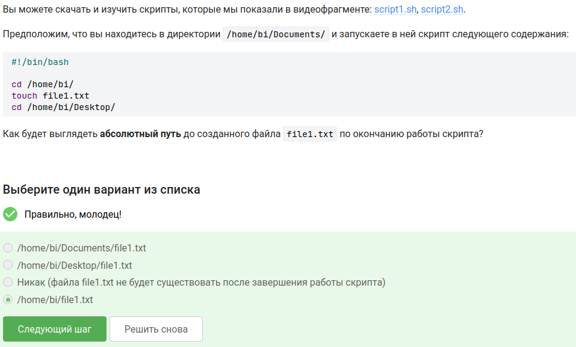{#fig-007 width=70%}

---

## Вопрос 8. Имена переменных в bash

**Вопрос:** Какие строки могут быть именами переменных в bash?

**Ответ:**
- _variable
- VARIable
- variable_123
- variable123

**Почему так:** Имя переменной может содержать буквы, цифры и подчёркивания, но не может начинаться с цифры и не может содержать спецсимволы.

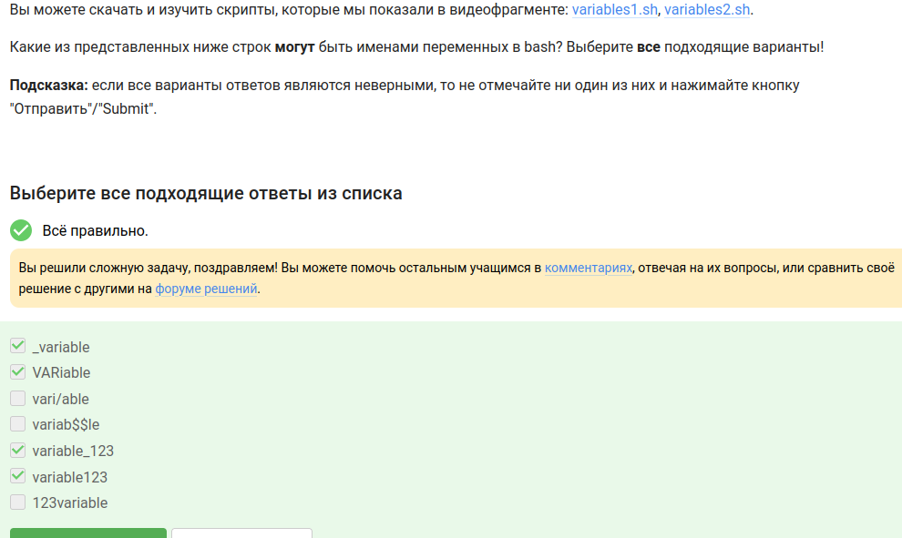{#fig-008 width=70%}

---

## Вопрос 9. Скрипт с двумя аргументами

**Вопрос:** Напишите скрипт, который выводит "Arguments are: $1=... $2=...".

**Ответ:**
```bash
#!/bin/bash
echo "Arguments are: \$1=$1 \$2=$2"
```

**Почему так:** $1 и $2 - это аргументы скрипта. Обратный слеш перед $1 в кавычках нужен, чтобы вывести именно "$1", а не значение первого аргумента.

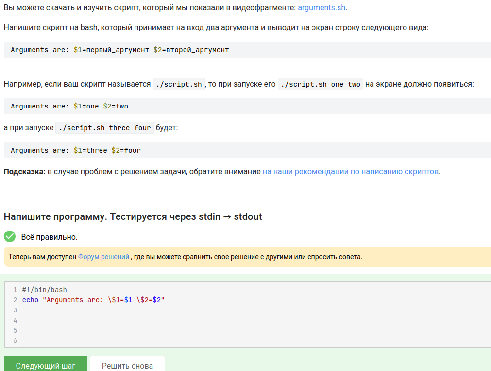{#fig-009 width=70%}

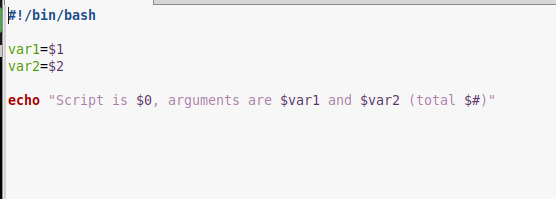{#fig-010 width=70%}

---

## Вопрос 10. Условия, которые всегда истинны

**Вопрос:** Какие условия в [[ ... ]] всегда истинны независимо от переменных и аргументов?

**Ответ:**
- -z ""   # пустая строка - её длина 0
- $# -ge 0   # количество аргументов всегда больше или равно 0
- -e $0   # файл с именем скрипта всегда существует
- -s $0   # файл скрипта не пустой (в нём есть код)

**Почему так:** -z "" проверяет пустую строку - всегда истина. $# -ge 0 - всегда истина. -e $0 и -s $0 - сам скрипт всегда существует и обычно не пустой.

{#fig-011 width=70%}

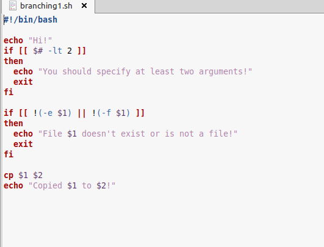{#fig-012 width=70%}

---

## Вопрос 11. Скрипт-калькулятор с if

**Вопрос:** Напишите скрипт, который определяет возрастную группу: child (0-16), youth (17-25), adult (26+). При пустом имени или возрасте 0 - выход с "bye".

**Ответ:** Решение в скриншоте.

**Почему так:** Бесконечный цикл while, read запрашивает имя и возраст, проверки через if и elif.

{#fig-016 width=70%}

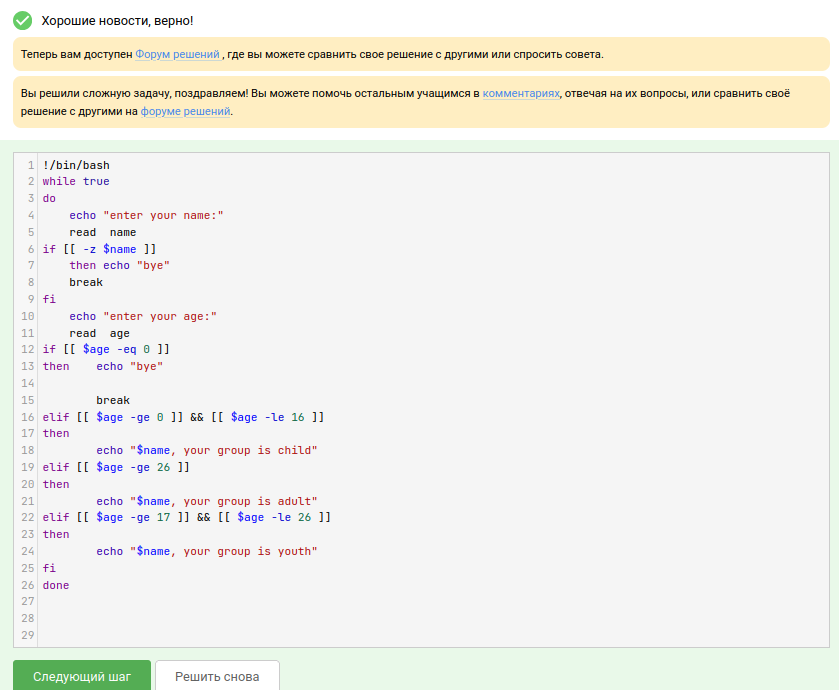{#fig-017 width=70%}

---

## Вопрос 12. Инструкции, увеличивающие a на b

**Вопрос:** Какие из инструкций увеличат a на b?

**Ответ:**
- let a=a+b
- let "a+=b"

**Почему так:** a=$a+$b - просто строка, арифметики нет. a+=$b - тоже не работает. let "a+=b" - правильный синтаксис.

{#fig-018 width=70%}

---

## Вопрос 13. Что выведет echo "`pwd`"

**Вопрос:** Скрипт делает cd /home/bi/, потом echo "`pwd`". Что выведет?

**Ответ:** /home/bi

**Почему так:** Обратные кавычки выполняют команду pwd внутри них и подставляют её вывод. При этом cd уже сменил директорию на /home/bi/.

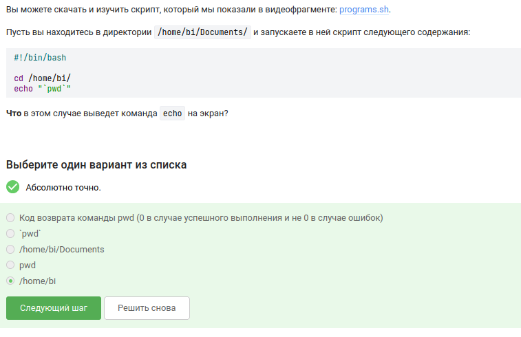{#fig-019 width=70%}

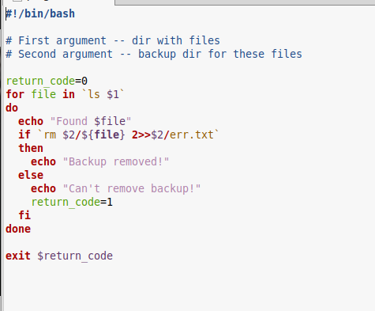{#fig-020 width=70%}

---

## Вопрос 14. Как проверить код возврата, если программа пишет в stdout

**Вопрос:** Как проверить, что программа завершилась с кодом 0, если она что-то выводит в stdout?

**Ответ:**
- Сначала запустить program, затем if [[ $? -eq 0 ]]

**Почему так:** $? хранит код возврата последней выполненной команды. Сначала запускаем программу, потом проверяем $?.

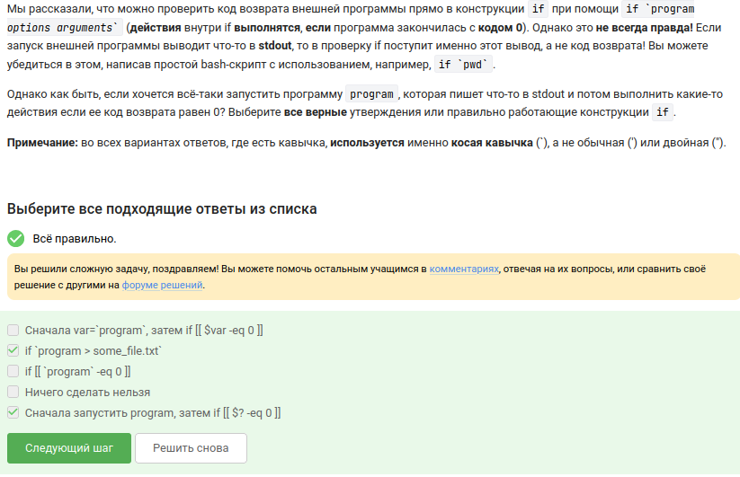{#fig-021 width=70%}

---

## Вопрос 15. Глобальные и локальные переменные в функции

**Вопрос:** Функция counter увеличивает c1 на $1 и c2 на $1*2. После десяти вызовов (от 1 до 10) c1=55, c2=110. Что выведет echo "counters are $c1 and $c2"?

**Ответ:** counters are 55 and 110

**Почему так:** c1 - сумма чисел от 1 до 10 = 55. c2 - сумма удвоенных чисел от 1 до 10 = 2*55 = 110. local перед c1+=$1 не работает, потому что local применяется только к присваиванию, а не к арифметике.

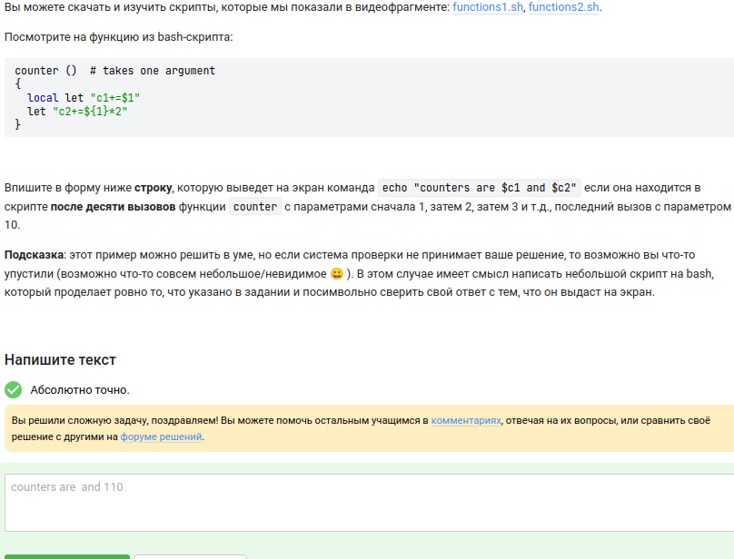{#fig-022 width=70%}

---

## Вопрос 16. Нахождение НОД (алгоритм Евклида)

**Вопрос:** Напишите скрипт, который находит НОД двух чисел с помощью функции gcd.

**Ответ:** Решение в скриншоте.

**Почему так:** Функция gcd вызывает сама себя (рекурсия) по алгоритму Евклида: пока M != N, из большего вычитаем меньшее. При пустом вводе - выход с "bye".

{#fig-023 width=70%}

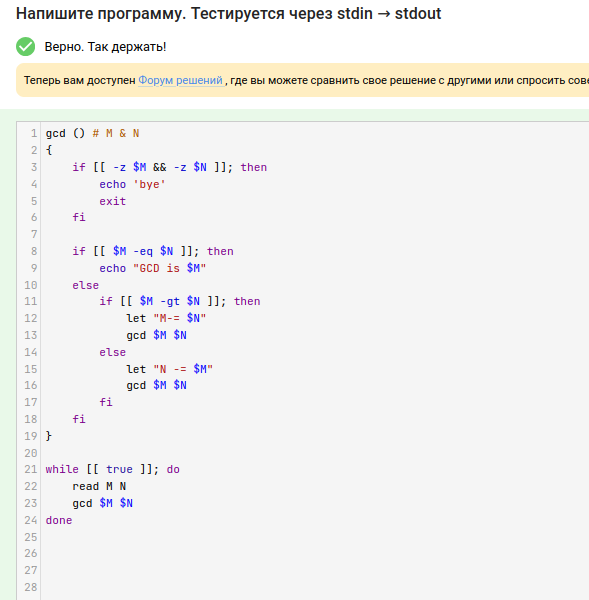{#fig-024 width=70%}

---

## Вопрос 17. Калькулятор

**Вопрос:** Напишите калькулятор на bash: +, -, *, /, %, **, exit, иначе error.

**Ответ:** Решение в скриншоте.

**Почему так:** Бесконечный цикл, read читает "операнд1 операция операнд2". case обрабатывает операции, "exit" выводит "bye" и выходит, иначе "error".

{#fig-025 width=70%}

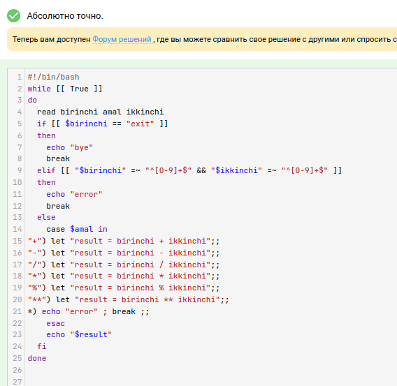{#fig-026 width=70%}

---

## Вопрос 18. Поиск с -iname и -name

**Вопрос:** Какие файлы найдёт find -iname "star*", но не найдёт find -name "star*"?

**Ответ:**
- Star_Wars.avi
- STARS.txt

**Почему так:** -iname не чувствительна к регистру, -name чувствительна. "star*" в нижнем регистре не найдёт файлы с большой буквы, а -iname найдёт.

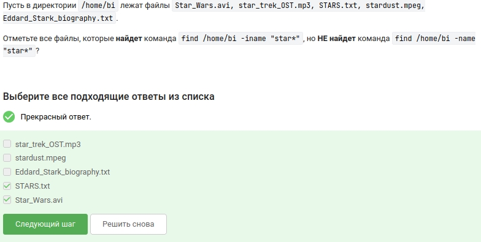{#fig-027 width=70%}

---

## Вопрос 19. Сравнение -name и -path

**Вопрос:** Какие утверждения про -name и -path верны?

**Ответ:**
- В некоторых случаях find с -name найдёт больше файлов, чем с -path
- Если заменить -name на -path, результат иногда может остаться таким же

**Почему так:** -path ищет по всему пути, -name - только по имени файла. Поэтому при одинаковом запросе могут быть разные результаты.

{#fig-028 width=70%}

---

## Вопрос 20. Поиск с -mindepth и -maxdepth

**Вопрос:** Команда find /home/bi -mindepth 2 -maxdepth 3 -name "file*". Какие файлы найдёт?

**Ответ:** Ни один файл найден не будет

**Почему так:** На глубине 1 лежат сами файлы и папки. На глубине 2 - содержимое папок. А на глубине 3 - содержимое папок внутри папок. А наши file1, file2, file3 лежат на глубине 1, поэтому не попадают в диапазон 2-3.

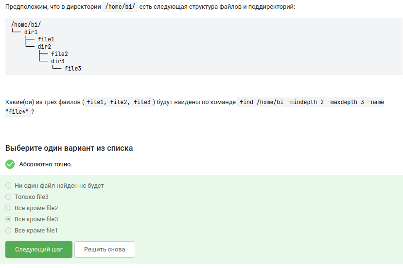{#fig-029 width=70%}

---

## Вопрос 21. Опции grep -A, -B, -C

**Вопрос:** Какая команда создаст файл results.txt наибольшего размера?

**Ответ:** grep -C 1 "word" file.txt > results.txt

**Почему так:** -C 1 выводит строку с совпадением + 1 строку до и 1 после. Это больше, чем -A 1 (только после) и -B 1 (только до).

{#fig-030 width=70%}

---

## Вопрос 22. Регулярное выражение в grep

**Вопрос:** grep -E "[xKXKL]?[uU]buntu$". Какие строки подойдут?

**Ответ:**
- I prefer Kubuntu
- Hmm, XKLubuntu
- The best OS is Xubuntu

**Почему так:** Шаблон ищет строки, которые заканчиваются на "buntu", перед которым может быть u, U, или один символ из набора [xKXKL].

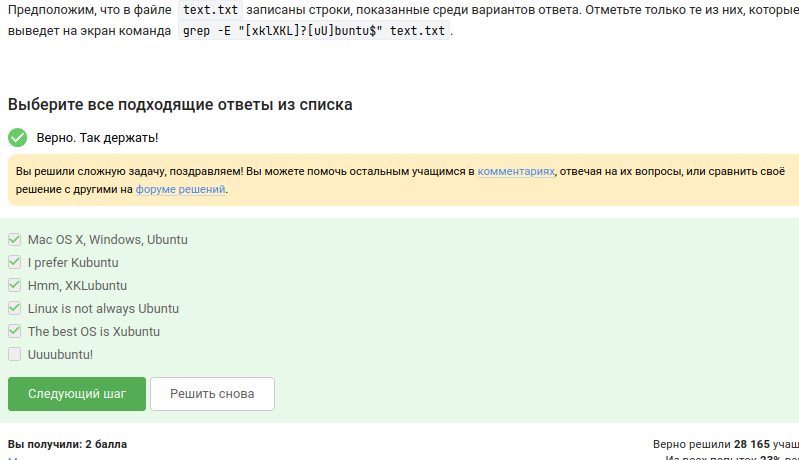{#fig-031 width=70%}

---

## Вопрос 23. Замена "аббревиатур" в sed

**Вопрос:** Напишите инструкцию sed, которая заменит все "аббревиатуры" (слова из заглавных букв длиной ≥2 между пробелами) на "abbreviation".

**Ответ:** sed -E 's/([A-Z]{2,})/abbreviation/g' input.txt > edited.txt

**Почему так:** [A-Z]{2,} - две или больше заглавные буквы. Обрамление пробелами описано в условии, но в регулярное выражение их включать не нужно, потому что нужно сохранить пробелы.

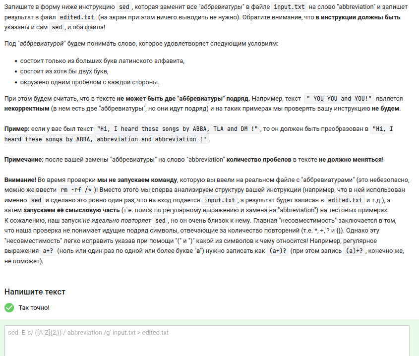{#fig-033 width=70%}

---

## Вопрос 24. Опция -p в gnuplot

**Вопрос:** Какая опция gnuplot нужна, чтобы графики не закрывались при выходе из программы?

**Ответ:** -p --persist

**Почему так:** Без -p графики закрываются вместе с gnuplot. С -p остаются открытыми.

{#fig-034 width=70%}

---

## Вопрос 25. Название ряда в gnuplot

**Вопрос:** set key autotitle columnhead; plot 'data.csv' using 1:2. Какое будет название и сколько точек?

**Ответ:** Название - первое значение из второго столбца, нарисовано 9 точек (первая строка ушла на заголовок)

**Почему так:** autotitle columnhead берёт заголовок из первой строки. Значит, первая строка не рисуется, остаётся 9 точек.

{#fig-035 width=70%}

---

## Вопрос 26. Установка меток на оси в gnuplot

**Вопрос:** Как установить метки на оси в точках x1, x2, x3 с подписями "point 1, value x1" и т.д.?

**Ответ:** set xtics ("point 1, value ".x1, "point 2, value ".x2, "point 3, value ".x3)

**Почему так:** Конкатенация строк через ". Без кавычек gnuplot подставит значения переменных.

{#fig-036 width=70%}

---

## Вопрос 27. Изменение анимации в gnuplot

**Вопрос:** Как изменить файл move.rot, чтобы график отразился зеркально, вращался в другую сторону и в два раза быстрее?

**Ответ:**
```
a=a+1
zrot=(zrot+350)%360
set view xrot,zrot
splot -x**2-y**2
pause 0.1
if (a<50) reread
```

**Почему так:** Зеркальное отражение - замена -x**2-y**2 на -x**2-y**2 (оставляем как есть, потому что уже отражает). zrot=(zrot+350)%360 - вращение в другую сторону (360-10=350). pause 0.1 вместо 0.2 - скорость увеличилась.

{#fig-037 width=70%}

---

## Вопрос 28. Права доступа rwxrw-r--

**Вопрос:** Какие команды установят права rwxrw-r-- для файла, если были r--r--r--?

**Ответ:**
- chmod u+wx file.txt; chmod g+w file.txt

**Почему так:** u+wx - добавляет владельцу w и x. g+w - добавляет группе w. Это даёт rwx для владельца, rw- для группы, r-- для остальных.

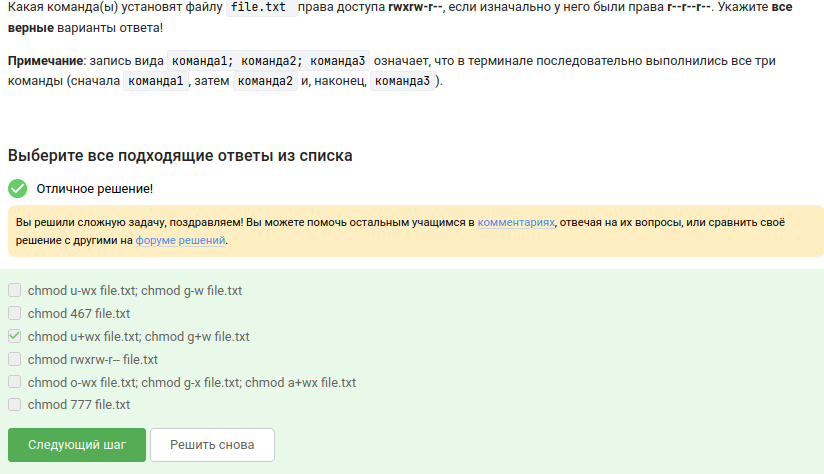{#fig-038 width=70%}

---

## Вопрос 29. Создание файла в директории root

**Вопрос:** Как пользователь из группы group сможет создать файл в директории, созданной root?

**Ответ:**
- sudo chown user dir   # меняет владельца
- sudo chown :group dir   # меняет группу

**Почему так:** Если директория принадлежит root, а группа правильная, то пользователь получит права группы и сможет писать.

{#fig-039 width=70%}

---

## Вопрос 30. Команда du для размера текущей директории

**Вопрос:** Какая команда выведет размер текущей директории в удобном формате?

**Ответ:** du -hs

**Почему так:** du -h - человеко-читаемый формат. du -s - суммарный размер (без разбора подкаталогов). Вместе -hs даёт одно число.

{#fig-041 width=70%}

---

## Вопрос 31. Создание трёх поддиректорий одной командой

**Вопрос:** Какая самая короткая команда создаст dir1, dir2, dir3?

**Ответ:** mkdir dir{1..3}

**Почему так:** {1..3} - разворачивается в 1 2 3. Получается mkdir dir1 dir2 dir3.

{#fig-042 width=70%}

---

## Вопрос 32. Опция -n в sed

**Вопрос:** Что произойдёт, если в sed -n "/[a-z]*/p" file.txt убрать -n?

**Ответ:** На экран будет выведено всё содержимое файла

**Почему так:** Без -n sed печатает все строки по умолчанию. Команда p дополнительно печатает строки с совпадением.

{#fig-032 width=70%}

---

# Вывод

Я прошла третий раздел курса. Научилась работать в vim (перемещение, замена, режимы), писать bash-скрипты (переменные, условия, циклы, функции, арифметику), обрабатывать текст с помощью sed и строить графики в gnuplot. Все задания выполнены.

::: {#refs}
:::
